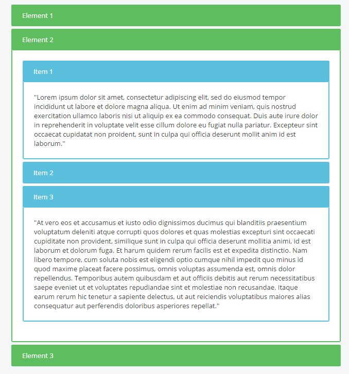
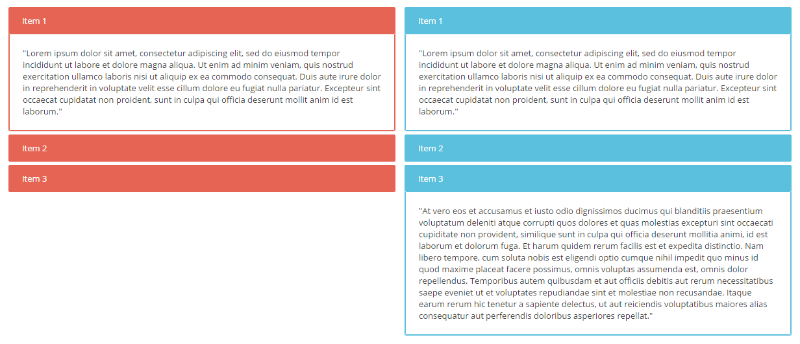
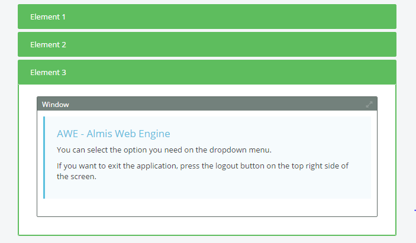

### Almis Web Engine - [Basic Development Guide](basic-developer-guide.md) - **[Screen development](basic-screen-development.md)**

---

# **Accordion**

## Table of Contents

* **[Introduction](#introduction)**
* **[XML skeleton](#xml-skeleton)**
* **[Accordion structure](#accordion-structure)**
* **[Accordion attributes](#accordion-attributes)**
* **[Accordion Item structure](#accordion-item-structure)**
* **[Accordion Item attributes](#accordion-item-attributes)**
* **[Dependencies](#dependencies)**
* **[Examples](#examples)**

---

## Introduction
An accordion is a layout component that allows to organize the content in different sections that can be collapsed or expanded.  Inside its panels, it allows to have the same content as a window or a tag element, even nested accordions.



## XML skeleton

```xml 
<accordion id="[accordion-identifier]" ...>
  <accordion-item... />
  <dependency... />
</accordion>
```

## Accordion structure

```xml
<accordion id="[accordion-identifier]" selected="[id-selected]" autocollapse="[accordion-autocollapse]" style="[accordion-style]">
...
</accordion>
```

## Accordion attributes

| Attribute   | Use          | Type      |  Description                |   Values                                           |
| ----------- | ------------ |-----------|-----------------------------|----------------------------------------------------|
| id | **Required** | String | Accordion identifier. For reference purposes |  |
| autocollapse | Optional | String | If set to "true" only accordion item can be opened at a time | `true` or `false` (default is `true`) |
| selected | Optional | String | If we want an accordion item to be opened at the beginning, we can via setting it's ID here |  |
| style | Optional | String | Grid CSS classes | We can use `panel-group-[type]` and `panel-group-dark` classes to style (type can be the usual `danger`, `success`, etc. values) |

## Accordion Item structure

```xml
<accordion-item id="[accordion-item-identifier]" label="[accordion-item-label]" 
style="[accordion-item-style]">
...
</accordion-item>
```

## Accordion Item attributes

| Attribute   | Use          | Type      |  Description                |   Values                                           |
| ----------- | ------------ |-----------|-----------------------------|----------------------------------------------------|
| id | **Required** | String | Accordion item identifier. For reference purposes |  |
| label | **Required** | String | Text to be placed inside of the header |  **Note:** You can use [i18n](i18n-internationalization.md) files (locales) |
| style | Optional | String | Grid CSS classes |  |

## Dependencies

If we want to collapse or expand an accordion item using a dependency, we must use one that modifies the attribute `selected` giving as the new value the ID of the item we want to modify (if it's expanded it will collapse and viceversa)

```xml
<dependency target-type="attribute" target-action="selected" value="[child-id]">
...
</dependency>
```

## Examples

Below we can see the difference between having the *autocollapse* attribute as `true` (left) or `false` (right)



Below an accordion item holding a window with an include



And this would be a full accordion structure example
```xml
<accordion id="acc2" autocollapse="false" style="panel-group-info">
    <accordion-item id="acc2-1" label="Item 1">
        <tag>
            <text>
                "Lorem ipsum ...  laborum."
            </text>
        </tag>
    </accordion-item>
    <accordion-item id="acc2-2" label="Item 2">
        <tag>
            <text>
                "Sed ut ... pariatur?"
            </text>
        </tag>
    </accordion-item>
    <accordion-item id="acc2-3" label="Item 3">
        <tag>
            <text>
                "At vero ... repellat."
            </text>
        </tag>
    </accordion-item>
</accordion>
```

