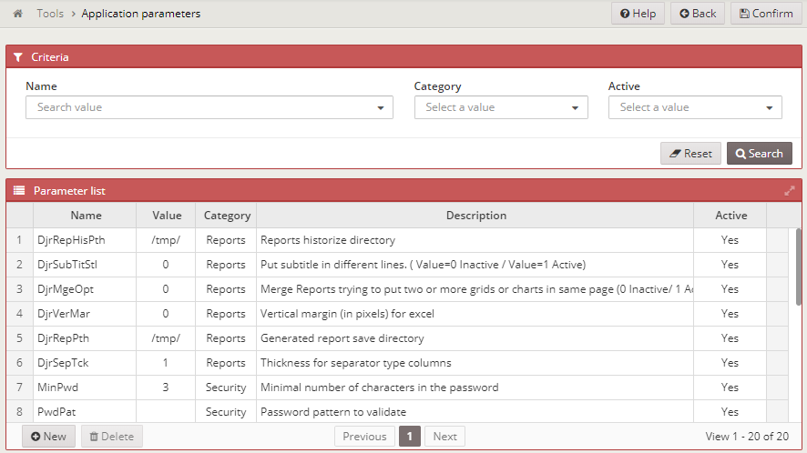

### Almis Web Engine - **[Configuration](configuration-guide.md)**

---

# **Application options**

## Table of Contents

* **[Introduction](#introduction)**
* **[Application parameters screen](#application-parameters-screen)**

---

## Introduction

The application options is a way to add property values via database. Application options 
are treated as properties and will overwrite the properties already defined with the same key.

## Application parameters screen

To manage the application options, you must navigate to `Tools -> Application parameters`.

There, you have a screen where you can add, update or delete the application screens in three
categories:

* **Security**: Security-related properties 
* **Reports**: Report generation properties
* **General**: Other properties