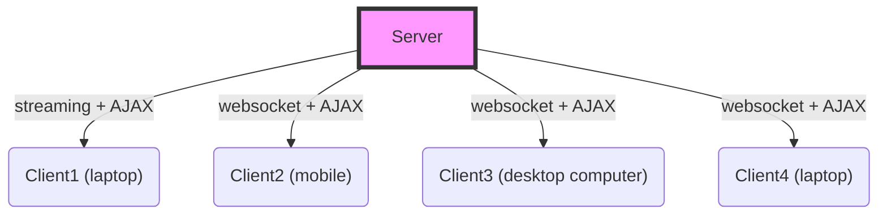
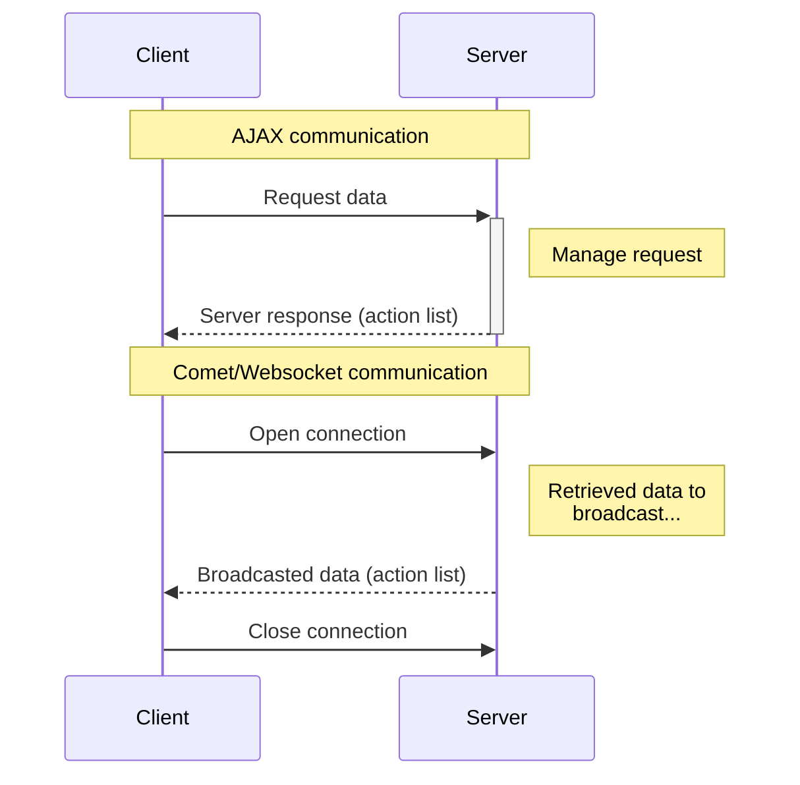
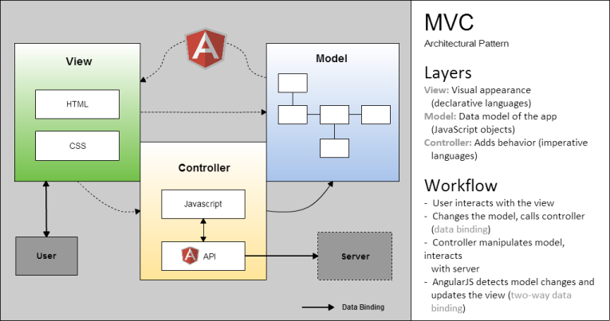

Almis Web Engine > **[Home](../README.md)**

---

# **Architecture**

## Table of Contents

* **[Physical architecture](#physical-architecture)**
* **[Communications architecture](#communications-architecture)**
* **[Client architecture](#client-architecture)**
* **[Server architecture](#server-architecture)**

---

## Physical architecture

Web applications developed with AWE can be deployed in many different environments depending on business requirements: in any different application server with J2EE.

With Ehcache framework, decentralized architecture is allowed. It also provides scalibility in multi node servers and clusters. In addition, applications can be integrated with cloud services like Amazon or Azure.

Connectors with main database engines, with some messaging servers, for example ActiveMQ and MQSeries, print servers or mail servers are available in AWE. About login process, it can be executed against active directory.

Talking about client side, using CSS3 media queries and libraries like Bootstrap allow us to generate responsive applications.

Summarizing, AWE-based applications can be easily and quickly adapted to the environment.

## Communications architecture

AWE uses Atmosphere framework to adapt the communication between browser and server side. Every message between them follows JSON format.

A bidirectional communication is established so the server not only responds to requests from clients, it also sends data to connected clients at any time.  

## Client architecture

Client-side is based on a typical Angular architecture: actually MVW (Model View Whatever).

The **View** is implemented by some HTML templates provided by the server. These templates depends on the components  belonging to the window we want to show.

The user interacts with the view and the Angular controller is responsible for updating the model with the results of this user action. The server can also modify the model as a result of a request. When Angular.js detects any change in the model, it updates the view to show this change.

Requests to the server are made by 'server-actions'. Each one returns one or more 'client-action' related to the components of the window.

All components generated by AWE windows are managed by complex Angular.js directives (composed of one or more subdirectives) where plugins developed in Angular.js can be encapsulated in.

When the application starts or a new language is selected, a new language package is downloaded and all texts in the application are updated inmmediatly.

## Server architecture

The main characteristic of server-side architecture is being a multilayer architecture over MVC standard. The aim of the AWE engine is to create modular applications allowing quick and easy changes.

The controller layer manages business logic. It handles requests from the clients by redirecting them to the service layer, where are managed by the corresponding engine:

* Screen engine: It generates JavaScript source code and CSS files from the XML screen file. It also manages screen actions.

* Data engine: Access to external systems to retrieve information.

* Maintain engine: Manages request to execute many different process: database queries, email delivery or report generations.

* Security engine: It is a layer between the model and controller layers, where requests are managed in order to provide security services against the most common attacks: SQl injection, XSS, etc.

* Document engine: Generates reports by using Jasper library.

