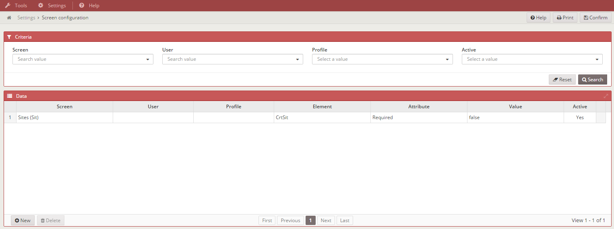

### Almis Web Engine - **[Basic Development Guide](basic-developer-guide.md)**

---

# **Default screens**

## Table of Contents

* **[Introduction](#introduction)**
* **[Sites](#sites)**
* **[Modules](#modules)**
* **[Profiles](#profiles)**
* **[Users](#users)**
* **[Databases](#databases)**
* **[Themes](#themes)**
* **[Screen access](#screen-access)**
* **[Encrypt util](#encrypt-util)**
* **[Screen configuration](#screen-configuration)**
* **[Report style configuration](#report-style-configuration)**
* **[Mail servers](#mail-servers)**
* **[Message queues](#message-queues)**
* **[Sequences](#sequences)**
* **[Application parameters](#application-parameters)**
* **[Broadcasting](#broadcasting)**
* **[Log](#log)**
* **[Report list](#report-list)**
* **[User manual](#user-manual)**
* **[Application help](#application-help)**
* **[About](#about)**

---

## Introduction

## Sites

## Modules

## Profiles

## Users

## Databases

## Themes

## Screen access

## Encrypt util

## Screen Configuration

This screen is used to change the functionality of the screen defined in XML file. The new functionality is saved in the data base and it can be restricted by user or profile. We only have to define the screen that we have select to modify, the element that will work like we wont and the new attribute with his value.

### Example:

If we have a criteria that is required `validation="required"`. 

``` xml
 <criteria id="CrtSit" label="PARAMETER_NAME" component="suggest" server-action="data" target-action="SitSug" style="col-xs-7 col-sm-6 col-lg-3" validation="required"/>
```

And we wont to be not required, put the new configuration like apear in the picture below.



### How to use it:

If you want to access and use this screen, put the next opction in your `private.xml` or `public.xml`.

``` xml
 <option name="screen_configuration" label="MENU_TOOLS_SCR_CNF" screen="ScrCnf" icon="laptop" />
```
## Report style configuration

## Mail servers

## Message queues

## Sequences

## Application parameters

## Broadcasting

## Log

## Report list

## User manual

## Application help

## About
