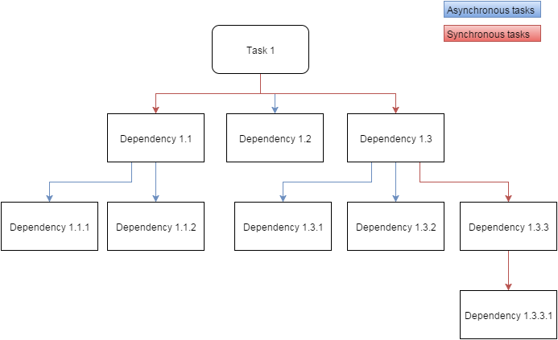

Almis Web Engine > **[Task guide](tasks.md)**

---

# **Dependencies guide**

## Table of Contents

* **[Introduction](#introduction)**
* **[Dependencies configuration](#dependencies-configuration)**
* **[Workflows](#workflows)**

## Introduction

Another powerful feature of the Scheduler module is the possibility of adding dependencies to a task. The dependencies are tasks that will be launched just after the parent task finishes. These dependencies can also contain other dependencies, creating a workflow.

There are two main types of dependencies.

### 1. Synchronous dependencies ###

The synchronous dependencies are, as their name suggest, executed in a synchronous way, in a configurable order.

The synchronous dependencies are created by setting the Blocking=Yes option.

By setting blocking to `yes` mean that, in case that any of the dependencies ends with an error, it will cancel the entire synchronous execution stack.

To manage the stack, there is the Order criterion, which is used to set the order in which the synchronous dependencies are going to be executed. 

### 2. Asynchronous dependencies ###

The asynchronous dependencies are executed in bulk and their execution order can't be configured.

As the dependencies are executed in bulk, they are not blocking between them.

## Dependencies configuration

The dependency configuration scree allows to create two type of dependencies, synchronous and asynchronous.

The difference between them is just that one is blocking whereas the other is not.

**In order to add a task as a dependency, its launch type must be set to `Manual`.**

| Element       | Definition    | Use   |
| ------------- |:-------------:| -----:|
| Task          | The task that the dependency is going to execute    | **Required** |
| Blocking      | Used to define if the dependency is going to be synchronous or asynchronous, and if it can cancel the synchronous dependencies execution stack | **Required** |
| Order         | Synchronous dependency execution order, only needed if the `Blocking` option is set to `Yes`, otherwise it will be disabled |  **Required** |

## Workflows

The next image shows an example on how to create a workflow using the scheduler dependencies concatenation.
