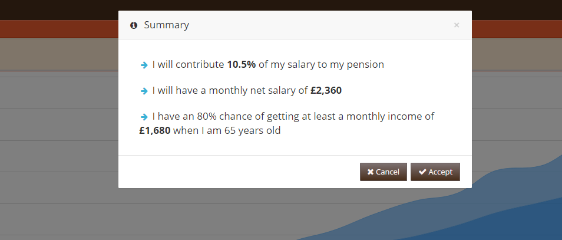
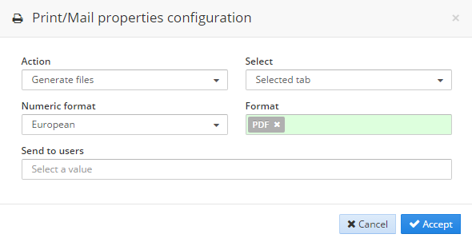

Almis Web Engine > [Basic Development Guide](basic-developer-guide.md) > **[Screen development](basic-screen-development.md)**

---

# **Dialog**

## Table of Contents

* **[Introduction](#introduction)**
* **[XML skeleton](#xml-skeleton)**
* **[Dialog structure](#dialog-structure)**
* **[Dialog attributes](#dialog-attributes)**
* **[Examples](#examples)**


## Introduction

A dialog is a graphical item that provides the functionality of showing a modal window with a selected message and title (with an icon if you want). A dialog should be associated to a button-action with type "dialog" (See [button actions](button.md#button-actions)).

---

## XML skeleton

```xml 
<dialog id="[dialog-identifier]" label="[dialog-label]" icon="[dialog-icon]"
  modal="[is-modal-screen]" style="[dialog-style]" help="[dialog-help]" on-close="[on-close]">
  [define the content of the dialog]
</dialog>
```

## Dialog structure

| Element     | Use      | Multiples instances    | Description                                        |
| ----------- | ---------|------------------------|----------------------------------------------------|
| [dialog](#dialog-attributes) | **Required** | No | Global node of dialog. Defines the dialog attributes |

## Dialog attributes

| Attribute   | Use      | Type      |  Description                    |   Values                                           |
| ----------- | ---------|-----------|---------------------------------|----------------------------------------------------|
| id          | Optional | String    | Dialog identifier. For reference purposes |                                          |
| label       | Optional | String    | Dialog title                    | **Note:** You can use [i18n](i18n-internationalization.md) files (locales)          |
| icon        | Optional | String    | Icon identifier                 | **Note:** You can check all iconset at [FontAwesome](http://fontawesome.io/icons/) |
| style       | Optional | String    | Style of the screen (css classes) | CSS classes separated by space (` `)             |
| help        | Optional | String    | Help text you want to show      | The name of a literal with the message             |
| on-close  | Optional | String    | Behaviour of the stack after closing the dialog  | `accept` (default), `reject`- Reject cancels the stack, accept continues executing stack actions  |

> **Note:** You can add the styles `modal-lg`, `modal-md` or `modal-sm` to change the width of the dialog.

## Examples

### Standard dialog with title, body and footer

This is an example with a dialog defined inside a modal tag in a screen. First of all, the action related to the dialog (by target attribute).



```xml 

    <button id="SetContribution" button-type="submit" label="BUTTON_SET_CONTRIBUTION" icon="floppy-o">
      <button-action type="filter" target="Resume" />
      <button-action type="dialog" target="Summary" />
    </button>

    <dialog id="Summary" label="SCREEN_TEXT_SET_CONTRIBUTION" icon="info-circle">
      <tag type="div" style="modal-body scrollable">
        <tag-list type="div" id="Resume" initial-load="query" target-action="Resume">
          <tag type="div" style="text-bg padding-sm">
            <tag type="i" style="fa fa-arrow-right text-info fa-fw" />
            <tag>
              <text> [Value]</text>
            </tag>
          </tag>
        </tag-list>
      </tag>
      <tag type="div" style="modal-footer">
        <tag type="div" style="pull-right">
          <button label="BUTTON_CANCEL" icon="close" id="ButDiaCan">
            <button-action type="close" target="Summary" />
          </button>
          <button label="BUTTON_ACCEPT" icon="check" id="ButDiaVal" button-type="submit">
            <button-action type="server" server-action="maintain" target-action="SetContribution" />
            <button-action type="close" target="Summary" />
          </button>
        </tag>
      </tag>
    </dialog>
```

### Standard dialog on a new screen

This example shows a dialog screen included in modal section of a window.



```xml

<button icon="print" label="BUTTON_PRINT" id="ButPrn" button-type="button">
  <button-action type="validate"/>
  <button-action type="dialog" target="PrnOpt"/>
</button>

<include target-screen="PrnOpt" target-source="center"/>

<screen xmlns:xsi="http://www.w3.org/2001/XMLSchema-instance" xsi:noNamespaceSchemaLocation="../../sch/screen.xsd" template="window">
  <tag source="center">
    <dialog id="PrnOpt" modal="true" style="normal" label="SCREEN_TEXT_PRINT_EMAIL" icon="print" help="HELP_SCREEN_TEXT_PRINT_EMAIL">
      <tag type="div" style="modal-body row">
        [body content]
      </tag>
      <tag type="div" style="modal-footer">
        [footer content]
      </tag>
    </dialog>
  </tag>
</screen>
```
