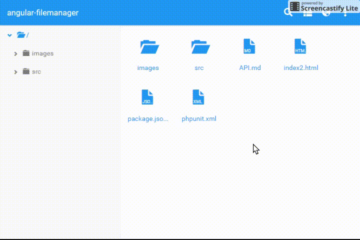

### Almis Web Engine - **[Modules](modules.md#tools-module)**

---

# **File Manager**

## What is it

With the file manager you can do move, copy, rename, remove, zip, unzip, download and upload files... 



To use this tool, the following steps are necessary (after adding the dependency):

- Create **new screen** with the widget awe-file-manager like `filemanager.xml`
```xml
<screen template="full" label="MENU_TEST_FILEMANAGER"
        xmlns:xsi='http://www.w3.org/2001/XMLSchema-instance'
        xsi:noNamespaceSchemaLocation='../../sch/awe/screen.xsd'>
  <tag source="center">
      <widget type="awe-file-manager" id="file-manager" style="expand"/>
  </tag>
</screen>
```

- Add this screen as **new menu option** with your own local and the option file-manager
```xml
    <option name="filemanager-test" label="MENU_TEST_FILEMANAGER" screen="filemanager-test" icon="folder" />
    <option name="file-manager" screen="file-manager" invisible="true"/>
```
