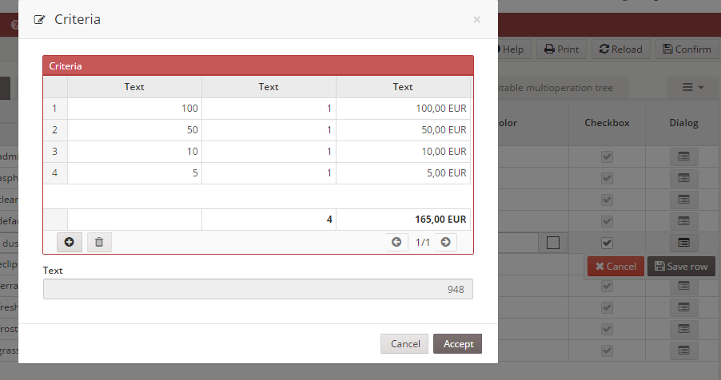
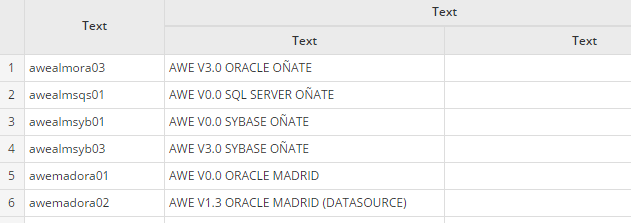
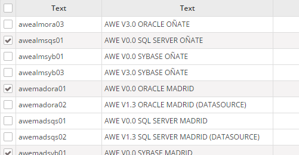
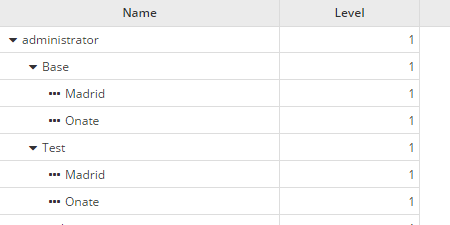
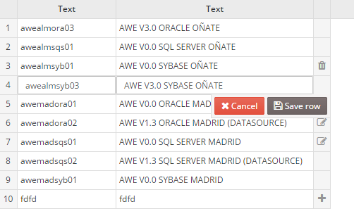
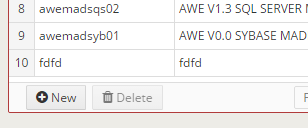
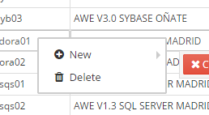

Almis Web Engine > [Basic Development Guide](basic-developer-guide.md) > **[Screen development](basic-screen-development.md)**

---

# **Grids**

## Table of Contents

* **[Introduction](#introduction)**
* **[XML skeleton](#xml-skeleton)**
* **[Grid structure](#grid-structure)**
  * [General attributes](#general-attributes)
* **[Column structure](#column-structure)**
  * [Column attributes](#column-attributes)
  * [Column components](#column-components)
  * [Specific column components](#specific-column-components)
* **[Group header structure](#group-header-structure)**
  * [Group header attributes](#group-header-attributes)
* **[Basic grid](#basic-grid)**
  * [Basic grid specific attributes](#basic-grid-specific-attributes)
* **[Multiselect grid](#multiselect-grid)**
  * [Multiselect grid specific attributes](#multiselect-grid-specific-attributes)
* **[Tree grid](#tree-grid)**
  * [Treee grid specific attributes](#tree-grid-specific-attributes)
* **[Editable grid](#editable-grid)**
  * [Editable grid specific attributes](#editable-grid-specific-attributes)
* **[Multioption grid](#multioption-grid)**
  * [Multioption grid specific attributes](#multioption-grid-specific-attributes)
* **[Grid buttons](#grid-buttons)**
* **[Context menu](#context-menu)**

## Introduction

The grid is the main component in AWE to show data lists. It is defined by *grid* and *columns*:

* The **grid** is the container of the data list. It has the query definition and a set of attributes to define the behaviour of the grid.
* Each **column** contains the source of the data from the datalist, the label of the column and other attributes to manage each column cell.

There is also a **group-header** tag which is used to show a second level header over a group of column headers.


## XML skeleton

To define a **grid** or a **treegrid** in AWE you must follow the next structure:

```xml
<grid id="[grid-identifier]" ...>
  <column ... ></column>
  ...
  <group-header ...>
    <column ...></column>
    ...
  </group-header>
  ...
  <button ... > ... </button>
  ...
  <context-button ...> ... </context button>
  ...
</grid>
```
## Grid structure

```xml
<grid id="[grid-id]" style="[grid-style]" 
      multiselect="[grid-is-multiselect]" checkbox-multiselect="[checkbox-multiselectable]" editable="[grid-is-editable]" send-operations="[grid-is-multioperation]" initial-load="[initial-load]" server-action="[server-action]" target-action="[target-action]" max="[elements-per-page] pagination-disabled="[pagination-disabled]"">
...
</grid>
```

### General attributes

| Attribute   | Use          | Type      |  Description                |   Values                                           |
| ----------- | ------------ |-----------|-----------------------------|----------------------------------------------------|
| id          | **Required** | String    | Grid identifier. For reference purposes |                                   |
| label       | Optional     | String    | Grid title (For printing only) | **Note:** You can use [i18n](i18n-internationalization.md) files (locales) |
| style       | Optional     | String    | Grid CSS classes            |                                                    |
| initial-load | Optional    | String    | Server action call to load the grid data. It only supports `query` value     |
| server-action | Optional   | String    | Server action call          | See [server action list](actions.md#server-actions)   |
| target-action | Optional   | String    | Target to call on the server|                                                    |
| max         | Optional     | Integer   | Maximum number of elements to retrieve **per page** |                            
| pagination-disabled  | Optional     | Boolean | Disabled the pagination element of grid | **Note:** Default value `false` |
| pager-values | Optional    | String    | Enable grid pager. Set the value list with the number of rows per page |  **Example:** `pager-value="5,25,50,100"`|
| load-all    | Optional | Boolean    | Load all values of the grid and sort and paginate locally | **Note:** Default value is `false` |
| send-all    | Optional | Boolean    | Send all values of the grid to the server instead of selected ones. (Selected ones will be sent on `.selected` parameter) | **Note:** Default value is `false` |
| help        | Optional     | String    | Help text for the grid | **Note:** You can use [i18n](i18n-internationalization.md) files (locales) |
| help-image  | Optional     | String    | Help image for the grid | This **must** be a image path |
| icon-loading | Optional    | String    | Set the loading icon | `spinner` (default), `square`, `circles`, `carpet`, `dots`, `folding`, `squarebar`, `circlebar`, `cubes`, `icon`, `custom`, `none` |
| report-title | Optional | String    | Is the title of the report that is generated when printing the screen. If we do not define a value for this attribute report title will be taken from label attribute | **Note:** You can use [i18n](i18n-internationalization.md) files (locales)          |

## Column structure

```xml
<column label="[column-label]" name="[column-name]" sort-field="[sort-field]" align="[text-align]" 
        charlength="[column-width-chars]" component="[column-component]" >
  <dependency ...> ... </dependency>
  ...
</column>
```

### Column attributes

| Attribute   | Use          | Type      |  Description                |   Values                                           |
| ----------- | ------------ |-----------|-----------------------------|----------------------------------------------------|
| name        | **Required** | String    | Column identifier. For reference purposes |                                   |
| sort-field  | Optional     | String    | Sort field to sort by (if not treegrid)   |                                   |
| type        | Optional     | String    | Field type (for printing purposes)  |  `string`, `integer`, `float` or `date` |
| hidden      | Optional     | Boolean   | Column is **not** visible   |  Default value is `false` |
| align       | Optional     | String    | Column is **not** visible   |  `left`, `center` or `right` |
| width       | Optional     | Integer   | Column width in pixels      |  |
| sortable    | Optional     | Boolean   | Field is sortable (if not treegrid) | Default value is `true` |
| movable   | Optional     | Boolean   | Allow move column position in the grid | Default value is `true` |
| sendable    | Optional     | Boolean   | Column data must be sent to the server | Default value is `true` |
| charlength  | Optional     | Integer   | Column width in chars       |  |
| label       | Optional     | String    | Column label | **Note:** You can use [i18n](i18n-internationalization.md) files (locales) |
| style       | Optional     | String    | Column css class            | Css class to apply to the column |
| component   | Optional     | String    | Column type (if editable)   | See [components](criteria.md#components) |
| max         | Optional     | Integer   | Max number of records to get when the column is initialized with target-action   | Default value is `30` |
| dialog      | Optional     | String    | Dialog identifier of the modal dialog that will be launched in `dialog` component |  |
| visibility  | Optional     | Boolean   | Initial visibility of the column component | Default value is `true` |
| frozen      | Optional     | Boolean   | Keep the column fixed out of the horizontal scroll. **WARNING**: Don't use this attribute if header has more than one line height |  Default value is `false` |
| excel-print-format| Optional     | String| When printing to excel, if we want to print the cells as number, we need to use this attribute and set its value as "numeric". **NOTE:** If the column has a "numeric" component, it is not needed to define this attribute to print the cells as numbers | |

> **Note:** When a column is editable (it has a *component*) all attributes of criteria can be used in the column. See **[criteria attributes](criteria.md#criteria-structure)** for more references.

### Column components

| Component   |  Description                                                                                                |
| ----------- | ------------------------------------------------------------------------------------------------------------|
| text        | Text column component. See [text criterion](criteria.md#text-criterion)                    |
| password    | Password column component. See [password criterion](criteria.md#password-criterion)        |
| textarea    | Textarea column component. See [textarea criterion](criteria.md#textarea-criterion)        |
| numeric     | Numeric column component. See [numeric criterion](criteria.md#numeric-criterion)           |
| date        | Date column component. See [date criterion](criteria.md#date-criterion)                    |
| time        | Time column component. See [time criterion](criteria.md#time-criterion)                    |
| filtered-date | Filtered date column component. See [filtered date criterion](criteria.md#filtered-date-criterion) |
| select      | Select column component. See [select criterion](criteria.md#select-criterion)              |
| suggest     | Suggest column component. See [suggest criterion](criteria.md#suggest-criterion)           |
| select-multiple | Select multiple column component. See [select multiple criterion](criteria.md#select-multiple-criterion) |
| suggest-multiple | Suggest multiple column component. See [suggest multiple criterion](criteria.md#suggest-multiple-criterion) |
| checkbox    | Checkbox column component. See [checkbox criterion](criteria.md#checkbox-criterion)        |
| color       | Color column component. See [color criterion](criteria.md#color-criterion)                 |
| uploader    | Uploader column component. See [uploader criterion](criteria.md#uploader-criterion)        |
| text-view   | Text view column component. See [text view criterion](criteria.md#text-view-criterion)     |
| formatted-text | HTML Text column component. See [formatted-text component](#formatted-text-column-component)     |
| icon        | Icon column component. Use it for showing font awesome icons in a column. |
| image       | Image column component. Use it for showing images in a column. |
| dialog      | Complex component which allows the user to open a dialog with different values in each row |
| button | Component which allows the user to click a button which launches a server action (requires `server-action` and `target-action` attributes to be filled) |
| progress    | Progress column component. Useful for showing a progress bar in a column. (Work in progress) |
| sparkline   | Sparkline column component. Useful for showing a sparkline chart in a column. (Work in progress) |

### Specific column components

There are several components developed specifically to be used in grid cells. These are those components:

#### Text view column component

This component is very useful to show an styled text inside a grid with an icon. The compound attributes to fill this component are the following:

| Attribute   |  Description                                                                                                |
| ----------- | ------------------------------------------------------------------------------------------------------------|
| icon        | Icon class. You can check all iconset at [FontAwesome](http://fontawesome.io/icons/) |
| value | Text to show. |
| label       | Text to show when you move the mouse over the icon. You can use [i18n](i18n-internationalization.md) files (locales) |
| style | CSS class to format the contents |

#### Icon column component


This component is very useful to show an icon inside a grid. The compound attributes to fill this component are the following:

| Attribute   |  Description                                                                                                |
| ----------- | ------------------------------------------------------------------------------------------------------------|
| icon        | Icon class. You can check all iconset at [FontAwesome](http://fontawesome.io/icons/) |
| label       | Text to show when you move the mouse over the icon. You can use [i18n](i18n-internationalization.md) files (locales) |

#### Formatted text column component

This component is very useful to show HTML code inside a grid. There are two type of HTML tags allowed:

* `<format style="[text class]">`: Formatted text. 
* `<br>`: New line

#### Image column component


This component is very useful to show an image inside a grid. The compound attributes to fill this component are the following:

| Attribute   |  Description                                                                                                |
| ----------- | ------------------------------------------------------------------------------------------------------------|
| image       | Image path |
| label       | Text to show when you move the mouse over the image. You can use [i18n](i18n-internationalization.md) files (locales) |

#### Dialog column component



A dialog column is a complex component which allows to define a new level of data inside a grid cell. It is shown as a button which opens a defined dialog, but the data stored in the dialog is attached to the cell, so that when it is reopened, it retrieves the data stored in the cell.

| Attribute   |  Description                                                                                                |
| ----------- | ------------------------------------------------------------------------------------------------------------|
| icon        | Icon class to show in the button. You can check all iconset at [FontAwesome](http://fontawesome.io/icons/) |
| label       | Text to show in the button. You can use [i18n](i18n-internationalization.md) files (locales) |
| title       | Text to show when you move the mouse over the button. You can use [i18n](i18n-internationalization.md) files (locales) |

#### Button column component

A button column is a component which allows to launch a server action from a grid row.

| Attribute   |  Description                                                                                                |
| ----------- | ------------------------------------------------------------------------------------------------------------|
| icon        | Icon class to show in the button. You can check all iconset at [FontAwesome](http://fontawesome.io/icons/) |
| label       | Text to show in the button. You can use [i18n](i18n-internationalization.md) files (locales) |
| title       | Text to show when you move the mouse over the button. You can use [i18n](i18n-internationalization.md) files (locales) |

#### Progress column component


The progress component is very useful to show the status of a job, or a task.

| Attribute   |  Description                                                                                                |
| ----------- | ------------------------------------------------------------------------------------------------------------|
| value       | Value (in percentage (0-100) of the progress bar |
| label       | Text to show in the progress bar |
| title       | Text to show when you move the mouse over the button. You can use [i18n](i18n-internationalization.md) files (locales) |

#### Sparkline column component

(Work in progress)

## Group header structure

```xml
<group-header label="[group-header-label]" name="[group-header-name]">
  <column...> ... </column>
  ...
</group-header>
```


### Group header attributes

| Attribute   | Use          | Type      |  Description                |   Values                                           |
| ----------- | ------------ |-----------|-----------------------------|----------------------------------------------------|
| name        | **Required** | String    | Group header identifier. For reference purposes |                                |
| label       | Optional     | String    | Group header label | **Note:** You can use [i18n](i18n-internationalization.md) files (locales) |

## Basic grid

The basic grid is the standard grid without a tree structure. It can be defined as single-select grid, multiselect grid, editable grid or multi-option grid, and combinations between them.



### Basic grid specific attributes

| Attribute     |  Type      |  Description                |   Values                    |
| ------------- | ---------- | --------------------------- | --------------------------- |
| show-totals   | Boolean    | Show a line with totalizers | Default value is `false`    |
| row-numbers   | Boolean    | Show the row numbers        | Default value is `false`    |


## Multiselect grid



### Multiselect grid specific attributes

| Attribute     |  Type      |  Description                       |   Values                    |
| ------------- | ---------- | ---------------------------------- | --------------------------- |
| multiselect   | Boolean    | Allow selecting more than one line | Default value is `false`    |
| checkbox-multiselect   | Boolean    | Allow selecting more than one line, but clicking **only** on the side checkboxes | Default value is `false`    |

## Tree grid

The tree grid is a grid that can be expanded as a tree. It can be defined as *standard tree*, *loading tree*, *editable tree* or *multi-option tree*, and combinations between them.

The data structure **needs** an **identifier per row**, and also a **parent identifier**, with no value if the row is a root row (with no parent). The identifier field must be defined on the grid tree-id attribute, and the parent must be defined on the tree-parent attribute.



### Tree grid specific attributes

| Attribute     |  Type      |  Description                |   Values                    |
| ------------- | ---------- | --------------------------- | --------------------------- |
| treegrid      | Boolean    | Set grid as treegrid        | Default value is `false`    |
| tree-id       | String     | Define identifier field     | Default value is `id`       |
| tree-parent   | String     | Define parent field         | Default value is `parent`   |
| tree-leaf     | String     | Define the 'is leaf' field        | Default value is `isLeaf`   |
| expand-column | String     | Name of the column to be expanded | Must be a column identifier |
| initial-level | Integer    | Initial level to expand     | Default value is `1` |
| icon-expand   | String     | Icon of a branch without expand | **Note:** You can check all iconset at [FontAwesome](http://fontawesome.io/icons/)  |
| icon-collapse | String     | Icon of a expanded branch   | **Note:** You can check all iconset at [FontAwesome](http://fontawesome.io/icons/)  |
| icon-leaf     | String     | Icon of a leaf branch       | **Note:** You can check all iconset at [FontAwesome](http://fontawesome.io/icons/)  |

## Editable grid


### Editable grid specific attributes

| Attribute     |  Type    |  Description                       |   Values                    |
| ------------- | -------- | ---------------------------------- | --------------------------- |
| editable      | Boolean  | Allow editing the grid rows        | Default value is `false`    |

## Multioption grid



> **Note:** The multioption grid will send a variable called `[GridId]-RowTyp` (where `[GridId]` is the identifier of the grid) containing the action done in each row (`INSERT`, `UPDATE` or `DELETE` actions)

### Multioption grid specific attributes

| Attribute       |  Type    |  Description                                                     |   Values                 |
| --------------- | -------- | ---------------------------------------------------------------- | ------------------------ |
| send-operations | Boolean  | Allow editing the grid rows, but sending only the modified lines | Default value is `false` |

## Grid buttons


You can add button elements to perform actions over the grids. For instance, a pair of buttons to insert and delete rows.




```xml
<grid id="GrdKeyLst" style="expand" initial-load="query" server-action="data" target-action="AweKeyLst" send-operations="true" editable="true" max="40">
  <column label="COLUMN_NAM" name="KeyNam" sort-field="KeyNam" align="left" charlength="20" component="text" validation="required">
    <dependency source-type="query" server-action="unique" target-action="AweKeyUni">
      <dependency-element id="GrdKeyLst" column="KeyNam" attribute="currentRowValue" />
    </dependency>
  </column>
  ...
  <button label="BUTTON_NEW" icon="plus-circle" id="ButGrdKeyLstAdd">
    <button-action type="add-row" target="GrdKeyLst" silent="true" />
  </button>
  <button label="BUTTON_DELETE" icon="trash" id="ButGrdKeyLstDel">
    <button-action type="delete-row" target="GrdKeyLst" silent="true" />
    <dependency target-type="enable" initial="true">
      <dependency-element id="GrdKeyLst" attribute="selectedRows" condition="==" value="1" />
    </dependency>
  </button>
</grid>
```

## Context menu

You can define a context-menu inside the grid to help the user do actions with the selected rows. See [context menu](context-menu.md).

