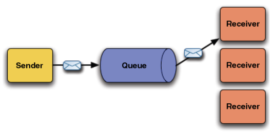
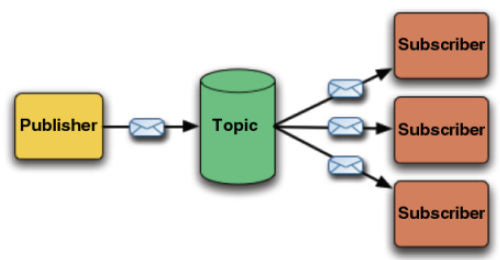

### Almis Web Engine - **[Basic Development Guide](basic-developer-guide.md)**

---

# **JMS queues definition**

## Table of Contents

* **[Introduction](#introduction)**
* **[Queue xml structure](#queue-xml-structure)**
* **[Synchronous messages](#synchronous-messages)**
  * [Send and receive data](#send-and-receive-data)
  * [Send data and receive message](#send-data-and-receive-message)
* **[Asynchronous messages](#asynchronous-messages)**
  * [Subscribe](#subscribe)
  * [Publish](#publish)
* **[Examples](#examples)**

---

## **Introduction**

The AWE Jms engine allows integration with queue servers. Both JMS typologies, **point to point** and **publish/subscribe**.

The `Java Message Service` (JMS) API is a Java Message Oriented Middleware (MOM) API for sending messages between two or more clients. JMS is a part of the Java Platform, Enterprise Edition, and is defined by a specification developed under the Java Community Process as JSR 914. 

It is a messaging standard that allows application components based on the Java Enterprise Edition (Java EE) to create, send, receive, and read messages. It allows the communication between different components of a distributed application to be loosely coupled, reliable, and asynchronous.

* **Point-to-point model**

In point-to-point messaging system, messages are routed to an individual consumer which maintains a queue of "incoming" messages. This messaging type is built on the concept of message queues, senders, and receivers. Each message is addressed to a specific queue, and the receiving clients extract messages from the queues established to hold their messages. While any number of producers can send messages to the queue, each message is guaranteed to be delivered, and consumed by one consumer. Queues retain all messages sent to them until the messages are consumed or until the messages expire. If no consumers are registered to consume the messages, the queue holds them until a consumer registers to consume them.



* **Publish - Subscribe model**

The publish/subscribe model supports publishing messages to a particular message topic. Subscribers may register interest in receiving messages on a particular message topic. In this model, neither the publisher nor the subscriber knows about each other. A good analogy for this is an anonymous bulletin board zero or more consumers will receive the message.

There is a timing dependency between publishers and subscribers. The publisher has to create a message topic for clients to subscribe. The subscriber has to remain continuously active to receive messages, unless it has established a durable subscription. In that case, messages published while the subscriber is not connected will be redistributed whenever it reconnects.




> **Note:** All queues  are defined in the `Queues.xml` file at **global folder**. View [project structure](basic-developer-guide.md#global-folder)  for more info.


## **Queue xml structure**

The full queue structure is the next one:

```xml
<queues xmlns:xsi="http://www.w3.org/2001/XMLSchema-instance"
xsi:noNamespaceSchemaLocation="../../sch/queues.xsd">
<queue id="[queue_ID]">
  <request-message destination="[queue_name]" type="[message_type]" [selector="[selector]" separator="[separator_char]" timeout="[timeOut]"]>
   <message-parameter id="[param_message_id]" type="[param_type]"   name="[param_name]" [list="[list]" value="[static_value]"] />
   <message-wrapper name="[name_wrapper]" type="[type_wrapper]" classname="[classname]" />
	… More <message-parameter/>
	… More <message-wrapper/>
  </request-message>
  <response-message destination="[queue_name]" type="[message_type]" [selector="[selector]" separator="[separator_char]" timeout="[timeOut]"]>
   <message-parameter id="[param_message_id]" type="[type_param]" name="[param_name]" [list="[list]" value="[static_value]"] />
   <message-wrapper name="[name_wrapper]" type="[type_wrapper]" classname="[classname]" />
	… More <message-parameter/>
	… More <message-wrapper/>
  </response-message>
 </queue>
 ... More <queue></queue>
</queues>
```

For even more simplify the development of queues, not all elements are required.


| Element     | Use      | Multiples instances    | Description                                        |
| ----------- | ---------|------------------------|----------------------------------------------------|
| queues | **Required**| No  | Root element of Queues structure  |
| [queue](#queue-element) |  **Required**| Yes | It outlines the queue |
| [request-message](#request-message-element) |  Optional | No | Used to define the request in the jms comunication |
| [response-message](#response-message-element) |  Optional | No | Used to define the response in the jms comunication |
| [message-parameter](#message-parameter-element) |  Optional | Yes | Are parameters of message for the request or response |

### Queue element

The `queue` element has the following attributes:

| Attribute   | Use      | Type      |  Description                    |   Values                                           |
| ----------- | ---------|-----------|---------------------------------|----------------------------------------------------|
| id | **Required** | String | Queue identifier          | **Note:** Must be the **same name** of attribute queue in `query.xml` or `maintain.xml`|

### request-message element

The `request-message` element has the following attributes:

| Attribute   | Use      | Type      |  Description                    |   Values                                           |
| ----------- | ---------|-----------|---------------------------------|----------------------------------------------------|
| destination | **Required** | String | Physical name of queue in JMS Server | **Note:**  Must be exist one record in **AweQue** table with this name|
| type | **Required** | String | Message type to send/receive | `MAP` (send a set of name-value pairs) or `TEXT` (sent a text info)    |
| selector | Optional | String | Set a a selector to filter the message consumption | **Ex.:** `selector="EUR"` It will consume only messages whose header `"JMSType=EUR"`    |

## **Synchronous messages**

### **Send and receive data**

### **Send data and receive message**

## **Asynchronous messages**

### **Subscribe**

### **Publish**

## Examples