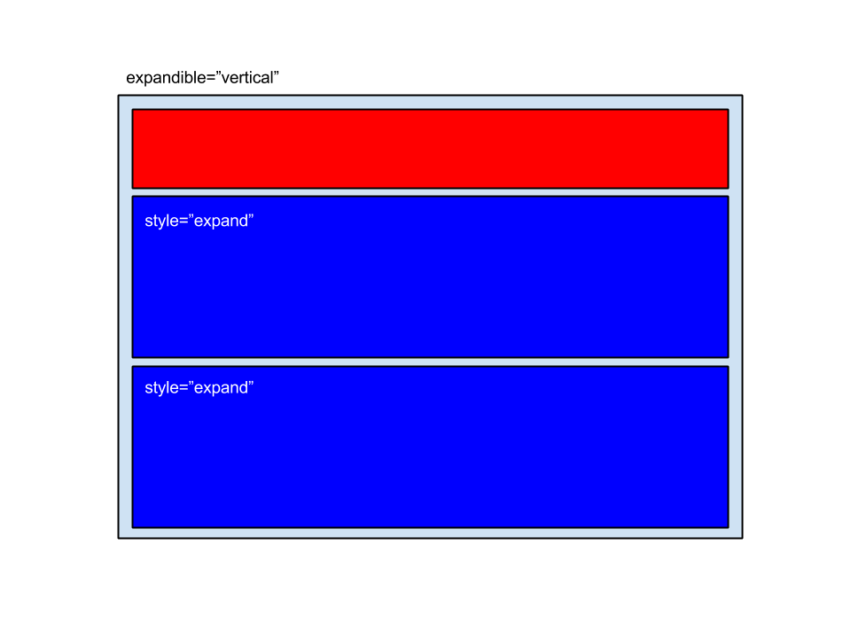
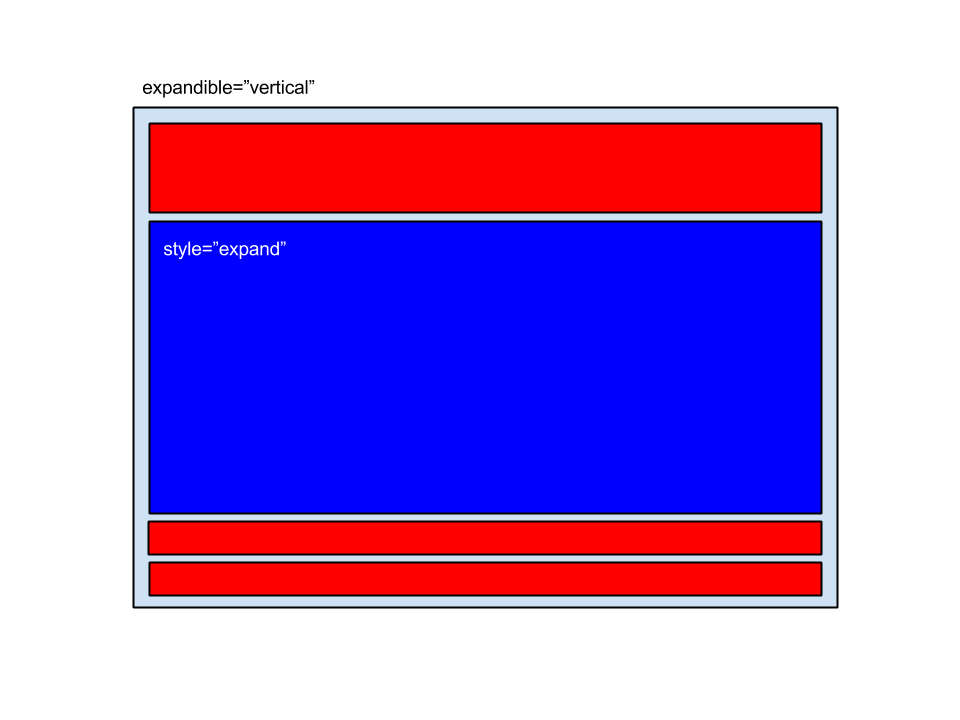
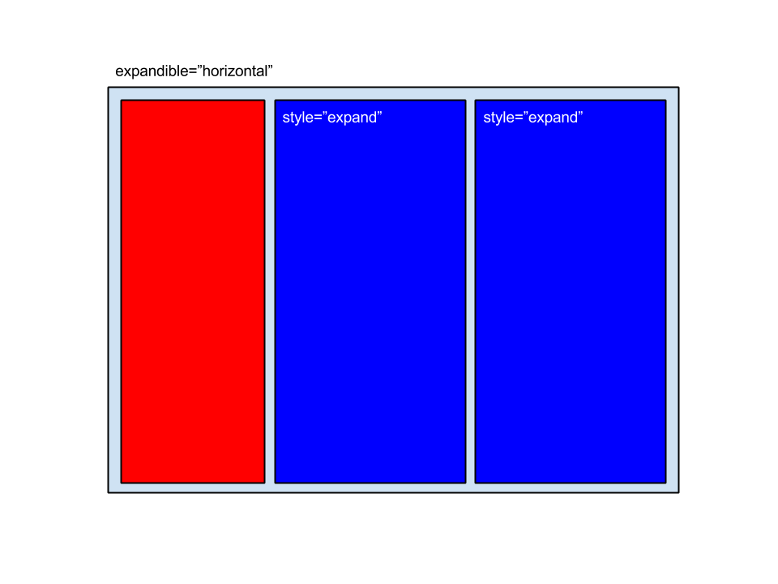
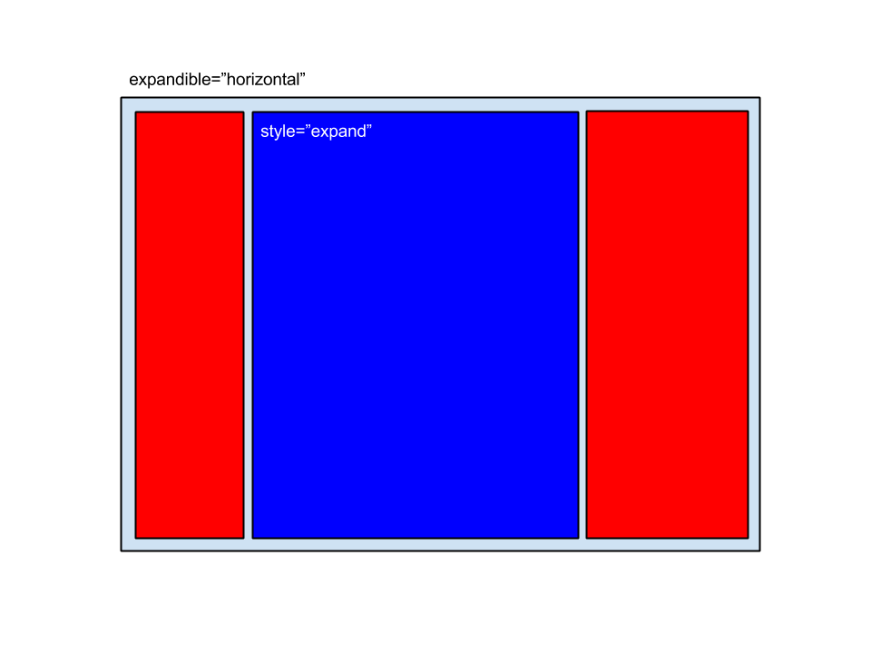
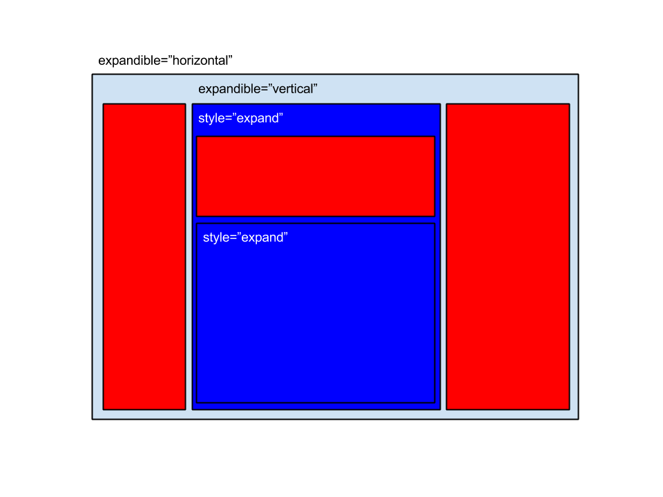
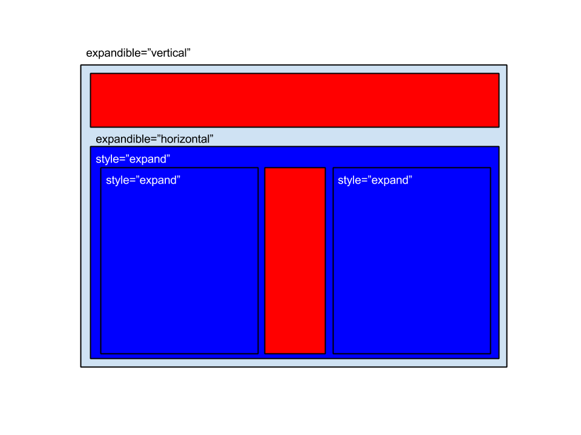
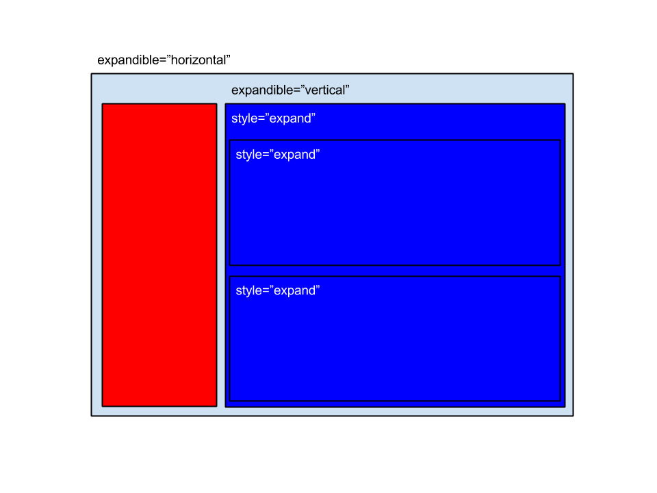

Almis Web Engine > [Basic Development Guide](basic-developer-guide.md) > **[Screen development](basic-screen-development.md)**

---

# **Layout**

## Table of Contents

* **[Introduction](#introduction)**
  * [Special expansion](#special-expansion)
* **[Vertical layout](#vertical-layout)**
* **[Horizontal layout](#horizontal-layout)**
* **[Combined layouts](#combined-layouts)**

---

## Introduction

In AWE screens there is a layout service which helps the developer to position the screen layers taking advantage of all the screen size. There are two ways of 'expanding' the layout:
* **[Vertically](#vertical-layout):** With the `expandible="vertical"` attribute the **direct children** with a `expand` style will increase in height to fit the container size. All children without the `expand` class will keep their height.
* **[Horizontally](#horizontal-layout):** With the `expandible="horizontal"` attribute the **direct children** with a `expand` style will increase in width to fit the container size. All children without the `expand` class will keep their width.

### Special expansion

There are some special styles which can be used to expand the layout sligthly different than with the standard `expand` style:
* `expand-2x`: Expand the tag with double size compared to a single `expand`.
* `expand-3x`: Expand the tag with triple size compared to a single `expand`.
* `expand-maximize`: Expand the layout of the tag **only** when the *parent* [window](window.md) is maximized.

## Vertical layout

In the following samples you can see an element with the `expandible="vertical"` attribute. Red boxes are children without the `expand` style, and blue boxes are children with the `expand` style:

### Two expandible children and one static child

### One expandible child and some static children

## Horizontal layout

In the following samples you can see an element with the `expandible="horizontal"` attribute. Red boxes are children without the `expand` style, and blue boxes are children with the `expand` style:

### Two expandible children and one static child

#### One expandible child and some static children

## Combined layout

To design an application screen you can combine the usage of vertical and horizontal layouts with expandible and not expandible children:

