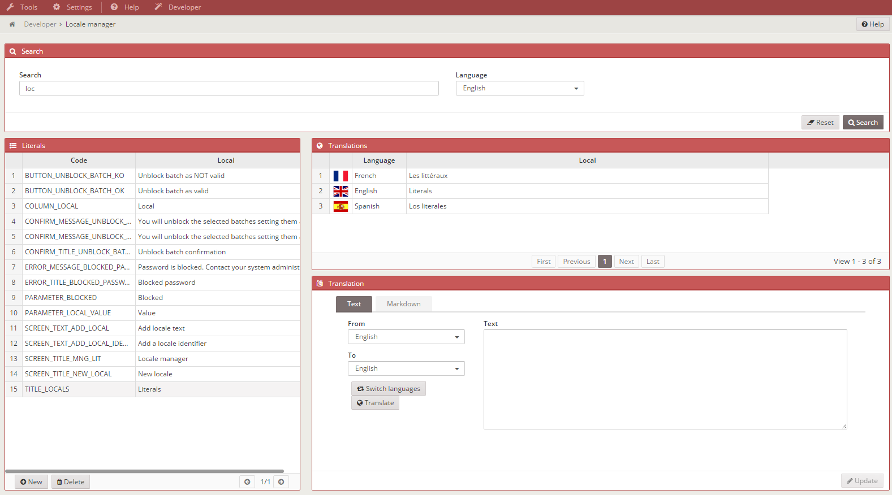
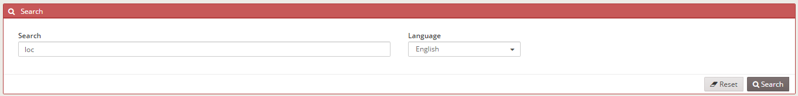
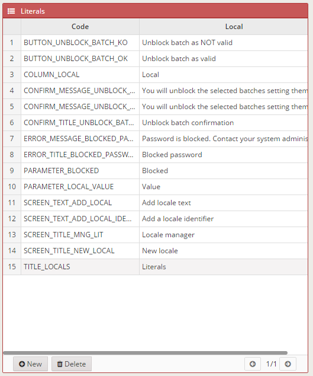
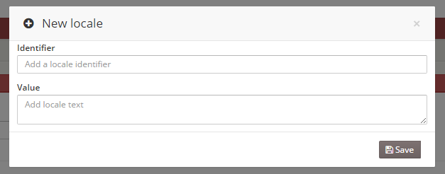
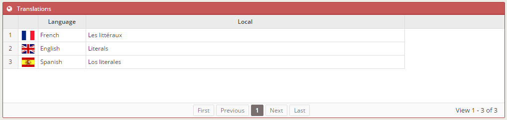
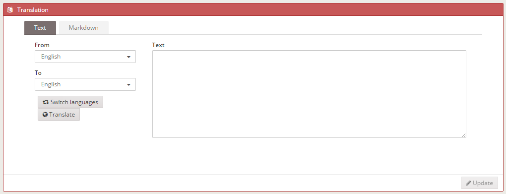
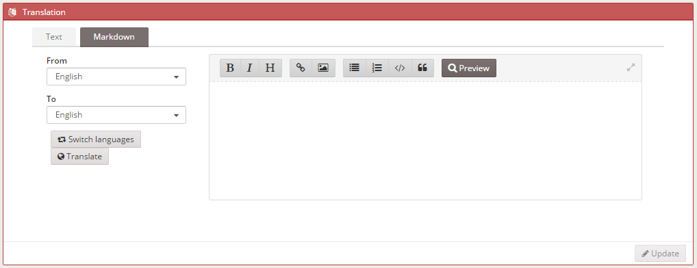
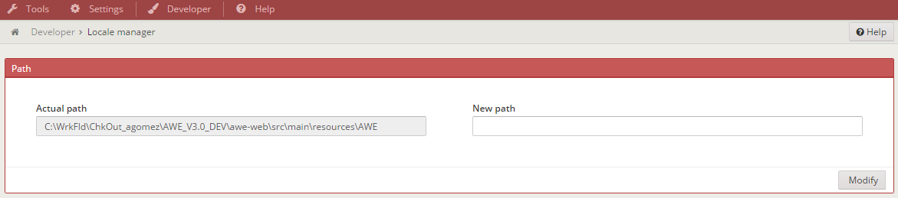
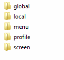
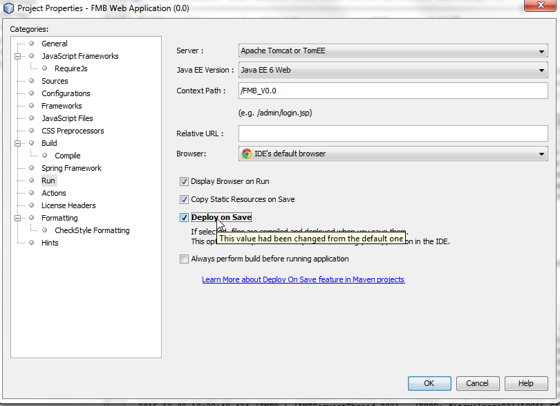

Almis Web Engine > **[Developer tools](developer-tools.md)**

---

# **Literal Manager**

## What is it

The *Literal Manager* is a tool that helps managing existing literals of an application. All the available actions and modifications are stored both in memory and in the multiple XML-s. This way, it is not necessary to restart the *Tomcat* server everytime a change is made, it is enough to refresh the page to display all the changes.



## What can it do

1. Search for existing literals.
2. Create new literals.
3. Modify existing literals.
4. Translate literals automatically to other languages.
5. Delete literals.

### Searching existing literals



Searches can be done by code or literal. The default search language is the same as the application default language, but it can be configured to search by any other *installed* language. By clicking on the search button next to the textfield, all the results appear in the left grid. In order to manage these literals, it is enough to click on any of them to display the details and translations of the chosen word.

### Deleting literals



This process is completed by selecting the literal that has to be deleted and clicking the delete button.

### Creating literals



New literals can be created by clicking on the *New* button. A modal view will appear with two inputs, the first one for the literal *code* and the second one to the literal contend in the default or chosen language. The tool generates the translatios for the other existing languages automatically.

### Modifying literals



In order to modify existing literals, a literal must be chosen from the list displayed on the left grid. The content of the literal appears in the Text / Markdown editor. Markdown is a markup language with plain text formatting syntax designed so that it can be converted to HTML and many other formats. This makes possible to add styles in a simple way.

### Translating literals

#### Text



#### Markdown



Select the language that you are writting in the markdown editor, then select the laguage in wich you want translate and click translate button. Voilà!

## How to start using it

AWE Developer is a module that comes inside AWE. 

To use this tool, the following is necessary

- Ensure that the .pom of your WEB project has dependency to awe-developer.

``` XML
   <dependecies>
    <dependency>
      <groupId>com.almis.awe</groupId>
      <artifactId>awe-developer</artifactId>
      <version>${awe.version}</version>
    </dependency>
    ...
```

### Launch

To use it, put a link to these windows some where in your project menu `public.xml` or `private.xml`.

Example:

``` XML
  <option name="developer" label="MENU_DEVELOPER" icon="paint-brush">
    <option name="path-manager"  label="MENU_PATH" screen="path-manager" icon="italic"/>
    <option name="local-manager" label="MENU_LANGUAGES" screen="local-manager" icon="language"/>
  </option>
```

- Add  the directory of your XML files using path window inside developer menu.



- The specified directory must have these folders



- Example of AWE directory in a local machine


* This tool does not make sense to work in the reference, only in local machines.

### IMPORTANT !!!

For a correct use, choose the option "Never publish automatically". 

* In Netbeans, right click in the project and click Properties > Run and deselect Deply on Save. 


