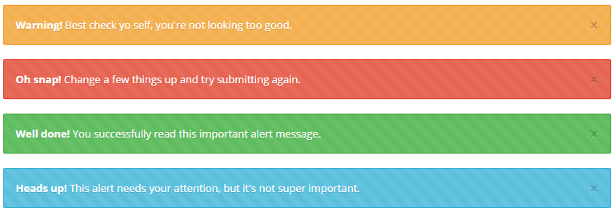

Almis Web Engine > [Basic Development Guide](basic-developer-guide.md) > **[Screen development](basic-screen-development.md)**

---

# **Messages**

## Table of Contents

* **[Introduction](#introduction)**
* **[Xml structure](#xml-structure)**
* **[Message attributes](#message-attributes)**
* **[Examples](#examples)**

## Introduction

Message element are messages to show after execute one action. Usually these message are described in the hidden section of the window.

This message element is referenced from target attribute in a button action.



## Xml structure

The xml structure of message element is the following:

```xml
  <tag source="hidden">
    <message id="[id]" title="[message-title]" message="[message-text]" />
    ... more messages ...
  </tag>
```

## Message attributes

| Name |  Type | Use | Description     | Values |
| ------ | -------| ---------------------- | ----------------------------------|---------------------------------------- |
|`id`| String | **Required**| Message identifier | |
|`title`| String | **Required**| Is the title of message | **Note:** You can use [i18n](i18n-internationalization.md) files (locales) |
|`message`| String | **Required**| Content of message  | **Note:** You can use [i18n](i18n-internationalization.md) files (locales)  |

## Examples

- Show a confirm message before insert new data

```xml
...
<tag source="hidden">
  <message id="NewMsg" title="CONFIRM_TITLE_NEW" message="CONFIRM_MESSAGE_NEW" />
</tag>
...
<button button-type="button" label="BUTTON_CONFIRM" icon="save" id="ButCnf" help="HELP_CONFIRM_BUTTON">
  <button-action type="confirm" target="NewMsg" />
  <button-action type="server" server-action="maintain" target-action="UsrNew" />
</button>
```
