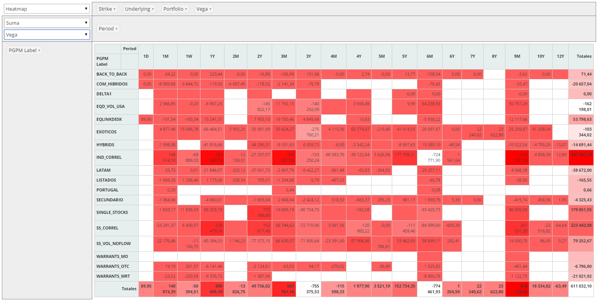

### Almis Web Engine - [Basic Development Guide](basic-developer-guide.md) - **[Screen development](basic-screen-development.md)**

---

# **Pivot table**

## Table of Contents

* **[Introduction](#introduction)**
* **[XML skeleton](#xml-skeleton)**
* **[Attributes](#attributes)**

## Introduction

The pivot table is an analytic component which allows the user to generate custom reports from a dataset, and play with those data in several ways.



## XML skeleton

To define a **pivot table** in AWE you must follow the next structure:

```xml
<pivot-table id="pivotTableId" target-action="getDataOfPivotTable" max="0" style="expand"/>
```

## Attributes

| Attribute   | Version | Use          | Type      |  Description                |   Values                                           |
| ----------- | ------------ | ------------ |-----------|-----------------------------|----------------------------------------------------|
| id          | 3.0 | **Required** | String    | Grid identifier. For reference purposes |                                   |
| style       | 3.0 | Optional     | String    | Grid CSS classes            |                                                    |
| initial-load | 3.0 | Optional    | String    | Server action call to load the grid data. It only supports `query` value     |
| server-action | 3.0 | Optional   | String    | Server action call          | See [server action list](actions.md#server-actions)   |
| target-action | 3.0 | Optional   | String    | Target to call on the server|                                                    |
| max         | 3.0 | Optional     | Integer   | Maximum number of elements to retrieve **per page** |                            |
| help        | 3.0 | Optional     | String    | Help text for the grid | **Note:** You can use [i18n](i18n-internationalization.md) files (locales) |
| help-image  | 3.0 | Optional     | String    | Help image for the grid | This **must** be a image path |
| total-row-placement | **New from 3.1** | Optional | String | Place the totalizer row | `top`, `bottom`. Default value is `bottom` |
| total-column-placement | **New from 3.1** | Optional | String | Place the totalizer column | `left`, `right`. Default value is `right` |
| renderer | **New from 3.1** | Optional | String | Initially selected renderer | `Table`, `Table Barchart`, `Heatmap`, `Row Heatmap`, `Col Heatmap`. Default value is `Table` |
| aggregator | **New from 3.1** | Optional | String | Initially selected aggregator | `Count`, `Count Unique Values`, `List Unique Values`, `Sum`, `Integer Sum`, `Average`, `Minimum`, `Maximum`, `Sum over Sum`, `80% Upper Bound`, `80% Lower Bound`, `Sum as Fraction of Total`, `Sum as Fraction of Rows`, `Sum as Fraction of Columns`, `Count as Fraction of Total`, `Count as Fraction of Rows`, `Count as Fraction of Columns`, `Custom aggregators`. Default value is null |
| aggregation-value | **New from 3.1** | Optional | String | Initially selected aggregation column | A column from the initial column list. Default value is null |
| sort-method | **New from 3.1** | Optional | String | Value sort method | `absolute` (absolute value sort), `natural` (natural sort). Default value is `natural` |
| rows | **New from 3.1** | Optional | String | Initially selected rows | Add more than one separated by commas |
| cols | **New from 3.1** | Optional | String | Initially selected columns | Add more than one separated by commas |
| decimal-numbers | **New from 3.1** | Optional | String | Number of decimals | **Note:** You have to set a custom aggregator like `Custom sum`, `Custom Average`, `Custom Minimum`, ...|
| thousand-separator | **New from 3.1** | Optional | String | Thousand character separator | **Note:** You have to set a custom aggregator. Default value is '.' |
| decimal-separator | **New from 3.1** | Optional | String | Decimal character separator | **Note:** You have to set a custom aggregator. Default value is ','  |