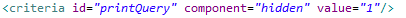

### Almis Web Engine - **[Home](../readme.md)**

---

# **Printing engine guide**

## Table of Contents

* **[Introduction](#introduction)**
* **[Printing a screen](#printing-a-screen)**
* **[Configure title](#configure-title)**
* **[Configure printing data](#configure-printing-data)**

## Introduction

AWE has a generic printing engine in order to print the content of a screen. This printing engine allows printing the content of a screen in pdf, excel and doc formats.

### Printing a screen

For printing a screen we first need to include the generic AWE printing dialog in the screen we want to print: 

The second step is to add a print button, that opens the dialog we have included: 

Once we have followed these two steps we are ready to print the screen. If we click in "Print" button the following dialog will be shown and we'll be able to select the printing options and generate the document we want:

### Configure title

By default, the title which is added when printing a report is generated as follows "report title : report subtitle", being the report subtitle the label of the tabcotainer, window, grid or whatever we have in the screen. AWE allows defining a new attribute if we want to configure a different title for the report. This attributte is "report-title" and permits different combinations.

If we have the following screen:

If we try to print it without any configuration, as mentioned before the title with be generated with the screen title (Bond cash blotter) and the tabcontainer title (Detail blotter):

Suppose we need to configure a different subtitle for the first tabcontainer. We just need to define the report-title attribute with the locale we need to set as report subtitle:

The screen does not change but if we print it we'll see the title is different:

Furthermore, we could have a different case in which we'd need to remove the main title from the report and generate the report just with the subreport title. For doing this, we just need to set an empty value to the report-title attribute of the screen:

As we can see in the following picture, this will make that the title is composed with the subtitle we have previously configured for the tabcontainer:

### Configure printing data

For AWE 3.2 and upper versions, the printing engine prints the content of the screen the user is viewing currently. It takes the data and sends it directly to the server to be printed. 

This can be a "problem" in some cases, for example if a grid has pagination and this pagination is made in the server (load-all="false"). This means that if we have a paginaton of 30 rows and server pagination, when we print the screen it will only print the 30 rows of the current page instead of printing all the rows. How to solve that? There are two options:

1. Change pagination to local-pagination (load-all="true"). This means that all the rows will be retrieved in the beginning and as we have all the rows in the browser when printing the screen all the rows will be printed as well. 
> **Warning**:  This is not always possible, because if we have a really big amount of rows in our screen we'll have serious performance problems. So, it has to be considered if this solution can be applied or not.

2. The second options is to execute the query of the grid again when printing the screen. The difference in this case is that the data of the database might be modified and the data the user is viewing in the screen and the data being printed could be different. For using this solution we need to add an additional hidden criterion to our screen: 

