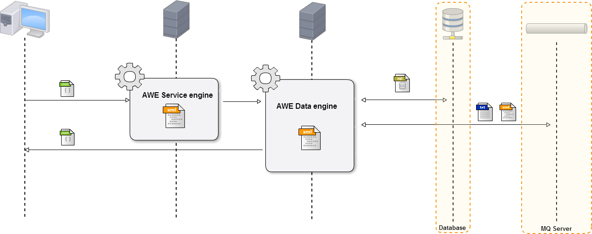

Almis Web Engine > **[Basic Development Guide](basic-developer-guide.md)**

---

# **Query definition**

## Table of Contents

* **[Introduction](#introduction)**
* **[SQL query](#sql-query)**
  * [XML sql structure](#xml-sql-structure)
  * [Global Sql query structure](#global-sql-query-structure)
     * [Query element](#query-element)
     * [Table element](#table-element)
     * [Field element](#field-element)
       * [Transform attribute](#transform-attribute)
     * [Constant element](#constant-element)
     * [Operation element](#operation-element)     
       * [Operator attribute](#operator-attribute)       
     * [Case element](#case-element)
     * [Over element](#over-element)
     * [Computed element](#computed-element)
     * [Compound element](#compound-element)
     * [Join element](#join-element)
     * [Union element](#union-element)
     * [Where element](#where-element)
     * [Having element](#having-element)
     * [Filter element](#filter-element)
     * [Group by element](#group-by-element)
     * [Order by element](#order-by-element)
     * [Totalize element](#totalize-element)
     * [Variable element](#variable-element)
  * [SQL queries examples](#sql-queries-examples)
* **[Enumerated query](#enumerated-query)**
  * [Xml enumerated structure](#xml-enumerated-structure)
  * [Enumerated examples](#enumerated-examples)
* **[Service query](#service-query)**
  * [Xml service structure](#xml-service-structure)
  * [Service examples](#service-examples)
* **[Queue query](#queue-query)**
  * [Xml queue structure](#xml-queue-structure)
  * [Queue examples](#queue-examples)


---

## Introduction


The AWE query engine is used in the query data on external systems. It works as an interface for querying data.





> **Note:** All queries are defined in the `queries.xml` file at **global folder**. View [project structure](basic-developer-guide.md#global-folder)  for more info.


## SQL query

This section describes how the database queries are handled with the AWE query engine.

### XML sql structure

The full sql query structure is the following:

```xml
<!-- Example sql query -->

<query id="[Query Id]" cacheable="[Cacheable]" distinct="Distinct" pagination="Pagination">
  <table id="[Table id]" schema="[Schema name]" alias="[Table alias] query="[Subquery]"/>
  <field id="[Field id]" table="[Table field]" alias="[Alias field]"/>
  ...
  <field id="[Field id]" table="[Table field]" alias="[Alias field]"/>
  <field variable="[Variable id]"/>
  <constant value="[Constant value]" type="INTEGER"/>
  <computed format="[Format]" alias="[Alias] transform="[Transform]"/>
  ...
  <computed format="[Format]" alias="[Alias] transform="[Transform]"/>
  <compound alias="[Compoun alias]">
    <computed format="[Format]" alias="[Alias]"/>
    ...
    <computed format="[Format]" alias="[Alias]"/>
  </compound>
  <join type="[Type join]">
   <table id="[Table id]" alias="[Table alias]"/>
     <and>
      <filter left-field="[Field]" left-table="[Table]" condition="[Condition]" right-field="[Counterfield]" 
      right-table="[Countertable]"/>
      ...
      <filter left-field="[Field]" left-table="[Table]" condition="[Condition]" right-variable="[Variable]"/>
    </and>
  </join>
  ...
  <union type="[union_type]" query="[Union subquery]"/>
  <where>
  <and>
    <filter left-field="[Filter field]" table="[Filter table]" condition="[Condition]" right-variable="[Variable]" optional="[Filter Optional]"/>
    <filter left-field="[Field 1]" table="[Filter table]" condition="[Condition]" 
      right-field="[Field 2]" right-table="[Table 2]" ignorecase="[Ignorecase]" trim="[Trim]"/>
    <filter left-field="[Field]" table="[Filter table]" condition="[Condition]" right-query="[Subquery]"/>
      <or>
       ... (more filters or filter groups)
      </or>
      ... (more filters or filter groups)
  </and>
  <or>
    ... (more filters or filter groups)
  </or>
 </where>
 <variable id="[Variable id]" type="[Variable Type]" name="[Variable name]" optional="[Optional]"/>
 ... (More <variable>)
 <group_by field="[Group field]" table="[Group table]" />
 ... (More <group_by>)
 <order-by field="[Order field]" table="[Order table]" type="[Order type]"/>
 ... (More <order-by >)
 <totalize function="[Totalize function]" label="[Label]" field="[Totalize field]" style="[Totalize style]">
   <totalize_by  field="[Totalize by field]"/>
   ... (more totalize by fields)
   <totalize_field field="[Totalize field]"/>
   ... (more totalized fields)
  </totalize>
</query>
```

### Global Sql query structure

To simplify the development of queries even more, not all elements are required.

| Element     | Use      | Multiples instances    | Description                                        |
| ----------- | ---------|------------------------|----------------------------------------------------|
| [query](#query-element) | **Required**| No |It outlines the query. Also describes the **kind of query** (service, queue, ...)  |
| [table](#table-element) | **Required**| Yes | The table or table list over the query is done |
| [field](#field-element) | **Required**| Yes | It describes the **column** of table |
| [computed](#computed-element) | Optional | Yes | Computed elements used to get query fields from other columns (field) |
| [compound](#compound-element) | Optional | Yes | Compound elements are a computed list. Used for get complex structures |
| [join](#join-element) | Optional | Yes | Used to do `joins` between tables |
| [union](#union-element) | Optional | Yes | Used to do `unions` between tables |
| [where](#where-element) | Optional | No | Is the `where` clause in sql query. It has the condition list of fields |
| [having](#having-element) | Optional | No| Is the `having` clause in sql query. It has the condition list of fields for functions |
| [group-by](#group-by-element) | Optional | Yes | Is the `group by` clause in sql query |
| [order-by](#order-by-element) | Optional | Yes | Is the `order by` clause in sql query |
| [totalize](#totalize-element) | Optional | Yes | Totalize element is used to totalize the query result |
| [variable](#variable-element) | Optional | Yes | It's parameters passed from screens to query |

### Query element

The *query* element has the following attributes:

| Attribute   | Use      | Type      |  Description                    |   Values                                           |
| ----------- | ---------|-----------|---------------------------------|----------------------------------------------------|
| id | **Required** | String | Query identifier                        | **Note:**  The id name must be unique              |
| distinct| Optional | Boolean | Is used to return only distinct (different) values | By default is `false`                 |
| cacheable| Optional | Boolean | Is used to set a query as cacheable (save data in memory and not execute again)  | By default is `false`. **Note:** If you set a **query as cacheable** and if there are subqueries, you must define on it the same variables that all subqueries have. |
| pagination| Optional | Boolean | To set a query as pagination (only load data of page in memory and not all).  High performance in queries with a very high number of records. | By default is `false`. **Note:** Only use this parameter in queries without totalize. |
| public | Optional | Boolean | To set a query as launchable out of session (without being logged). | By default is `false`|
| enumerated | Optional | String | The name of enumerate to load the query  | **Note:** Only apply in enumerated queries. For more info. see [enumerated query](#enumerated-query)|
| service | Optional | String | The name of service to load the query  | **Note:** Only apply in service queries. For more info. see [service query](#service-query)|
| queue | Optional | String | The name of queue to load the query  | **Note:** Only apply in queue queries. For more info. see [queue query](#queue-query)|

### Table element

The *table* element has the following attributes:

| Attribute   | Use      | Type      |  Description                    |   Values                                           |
| ----------- | ---------|-----------|---------------------------------|----------------------------------------------------|
| id | **Required** | String | Name of table |  **Note:** Is the real table name in data base            |
| schema| Optional  | String | Schema of table. It used to set the user owner of table| **Note:** Is the real schema (user) name in data base |
| alias | Optional  | String | Alias of table. It used to temporarily rename a table or a column heading |                  |
| query | Optional  | String | Is the Id of a subquery to be used as data source |                                          |

#### Subquery example

```xml

  <query id="GetProcessedAccounting" distinct="true">
    <field id="Name" alias="nameCol" table="a" />
    <field id="Created_Date" alias="createdDateCol" table="a"/>
    <field id="Type" alias="typeCol" table="a"/>
    <field id="ddo.OperationsCol" />
    <table id="ACCOUNTING" alias="a" />
    <join type="LEFT">
      <!-- Use Subquery -->
      <table alias="ddo" query="GetProcessedAccountingDirectDebit"/>
      <and>
        <filter left-field="IdCol" left-table="ddo" condition="eq" right-field="Id" right-table="a" />
      </and>
    </join>
  </query>
  
  <!-- Define Subquery -->
  <query id="GetProcessedAccountingDirectDebit">
    <field id="Id" alias="idCol" table="a" />
    <field id="Id" alias="OperationsCol" function="COUNT" table="a"/>
    <table id="ACCOUNTING" alias="a" />
    <join type="LEFT">
        <table id="ADEUDO_OPERACION"  alias="o"/>
        <and>
          <filter left-field="Accounting_Id" left-table="o" condition="eq" right-field="Id" right-table="a" />
        </and>
    </join>
    <where>
      <and>
        <filter left-field="Accounting_Id" left-table="o" condition="is not null" />
      </and>
    </where>
    <group-by field="Id" table="a"/>
  </query>
```
### Field element

The *field* element has the following attributes:

| Attribute   | Use      | Type      |  Description                    |   Values                                           |
| ----------- | ---------|-----------|---------------------------------|----------------------------------------------------|
| id | Optional | String | Name of field | **Note:** Is the real column name of table in data base            |
| table | Optional | String | Table name of field |  |
| alias | Optional | String | Alias of field. It used to describe the field |  |
| noprint| Optional | Boolean | Used to set a field as no print. (Field value isn't loaded in resultset)  | |
| transform | Optional | String | Used to format the field value | The possible values are: `DATE`, `DATE_MS`, `TIME`, `TIMESTAMP`, `JS_DATE`, `JS_TIMESTAMP`, `GENERIC_DATE`, `DATE_RDB`, `NUMBER`, `NUMBER_PLAIN`, `TEXT_HTML`, `TEXT_UNILINE`, `TEXT_PLAIN`, `MARKDOWN_HTML`, `DECRYPT`, `ARRAY`. See [this](#transform-attribute) for more info about transform attribute.|
| pattern | Optional | String| Used in a field with number type, defines the pattern to format the number  | See [this page](http://docs.oracle.com/javase/tutorial/i18n/format/decimalFormat.html) for more info |
| translate | Optional | String| Translates the output with an enumerated group identifier | **Note:** If the field value is equal to an enumerated value, output the enumerated label |
| function | Optional | String | To apply sql function to field|The possible values are defined in [field functions](#field-functions) |
| cast  | Optional | String | Change the field format | The possible values are `INTEGER`, `LONG`, `FLOAT` and `DOUBLE` |
| query | Optional | String | Is the query identifier to do a subquery  | **Note:** The query id must exist, and `table` and `id` attributes will be ignored |
| variable | Optional | String | A variable identified to be used as field value | **Note:** If `variable` attribute is defined, `table` and `id` attributes will be ignored |

> **Note:** The order in attribute reading for fields is the following:
> 1. `query`
> 2. `variable`
> 3. `id` (and `table` if defined)
>
> At least one of the previous attributes is required in a field.

#### Field functions

- `ABS`: Absolute value
- `AVG`: Average of values 
- `CNT`: Count values
- `CNT_DISTINCT`: Count distinct values
- `MAX`: Max value
- `MIN`: Min value
- `SUM`: Sum values
- `ROW_NUMBER`: Row number
- `TRUNCDATE` (not standard): Truncate date
- `YEAR`: Retrieve year from date
- `MONTH`: Retrieve month from date
- `DAY`: Retrieve day from date
- `HOUR`: Retrieve hours from date
- `MINUTE`: Retrieve minutes from date
- `SECOND`: Retrieve seconds from date

#### Transform attribute

These are the possible values for the `transform` attribute:

* **DATE**: Transform the output field **(Date/String)** into a web date field (`dd/MM/yyyy`)
* **DATE_MS**: Transform the output field **(Date/String)** into a java date in milliseconds (for chart datetime axes)
* **TIME**: Transform the output field **(Date/String)** into a web time field (`HH:mm:ss`)
* **TIMESTAMP**: Transform the output field **(Date/String)** into a web timestamp field (`dd/MM/yyyy HH:mm:ss`)
* **JS_DATE**: Transform the output field **(Date/String)** into a javascript date field (for chart axes) (`MM/dd/yyyy`)
* **JS_TIMESTAMP**: Transform the output field **(Date/String)** into a javascript timestamp field (`MM/dd/yyyy HH:mm:ss`)
* **GENERIC_DATE**: Transform the output field **(String)** from a date format defined on `format-from` to a date format defined on `format-to`
* **DATE_RDB**: Transform the output field **(String)** from an English RDF format (`dd-MMM-yyyy`) to a web date field (`dd/MM/yyyy`)
* **NUMBER**: Transform the output field as a number with a pattern. **IMPORTANT**:
 *  When using this transform, the associated pattern has to have thousand separator. For instance: ###,###.00
 * **NEVER** use this transform if the retrieved data is for a numeric component
 * This transform is normally used when we want to show a numeric value in a visualization grid (columns without component)
* **NUMBER_PLAIN**: Transform the output field as a number with a raw pattern (without thousand separator). **IMPORTANT**:
 * When using this transform, the associated pattern must not have a thousand separator (e.g: ###.00)
 * It can be used for numeric components as well as for elements that have no component.
 * This transform is normally used when we want to print numeric components for specifying the numer of decimals we want to see in the pdf file. Usually, the number of decimals of the pattern will match the "precision" defined in the number-format attribute of the numeric component.
* **TEXT_HTML**: Transforms the output field into HTML text (to be showed in a HTML page)
* **TEXT_PLAIN**: Transforms the output field into plain text (to be showed inside a document)
* **TEXT_UNILINE**: Transforms the output field into a plain text without line breaks
* **MARKDOWN_HTML**: Transforms the output field from Markdown into HTML text (to be showed in a HTML page)
* **DECRYPT**: Decrypt a column value which is encrypted in the database
* **ARRAY**: Split a string value with the string in `pattern` attribute

### Constant element

The *constant* element has the following attributes:

| Attribute   | Use      | Type      |  Description                    |   Values                                           |
| ----------- | ---------|-----------|---------------------------------|----------------------------------------------------|
| alias | Optional | String | Alias of field. It used to describe the field |  |
| noprint| Optional | Boolean | Used to set a field as no print. (Field value isn't loaded in resultset)  | |
| transform | Optional | String | Used to format the field value | The possible values are: `DATE`, `DATE_MS`, `TIME`, `TIMESTAMP`, `JS_DATE`, `JS_TIMESTAMP`, `GENERIC_DATE`, `DATE_RDB`, `NUMBER`, `NUMBER_PLAIN`, `TEXT_HTML`, `TEXT_UNILINE`, `TEXT_PLAIN`, `MARKDOWN_HTML`, `DECRYPT`, `ARRAY`. See [this](#transform-attribute) for more info about transform attribute.|
| pattern | Optional | String| Used in a field with number type, defines the pattern to format the number  | See [this page](http://docs.oracle.com/javase/tutorial/i18n/format/decimalFormat.html) for more info |
| translate | Optional | String| Translates the output with an enumerated group identifier | **Note:** If the field value is equal to an enumerated value, output the enumerated label |
| function | Optional | String | To apply sql function to field|The possible values are defined in [field functions](#field-functions) |
| cast  | Optional | String | Change the field format | The possible values are `INTEGER`, `LONG`, `FLOAT` and `DOUBLE` |
| value | Required | String | A static value to be used as field value |  |
| type | Optional | String | Type of the value | The possible values are available [here](#variable-types) |

### Operation element

The *operation* element allows to define operation between fields and will be resolved as SQL clauses:

```xml
<operation operator="[operator]" alias="[alias]">
  <constant value="[constant value]" />
  <field id="[field name]" table="[field table]" />
  ...
</field>
```

| Attribute   | Use      | Type      |  Description                    |   Values                                           |
| ----------- | ---------|-----------|---------------------------------|----------------------------------------------------|
| operator    | Required | String    | Operator of the operation       | See [operator attribute](#operator-attribute)      |
| alias | Optional | String | Alias of field. It used to describe the field |  |
| noprint| Optional | Boolean | Used to set a field as no print. (Field value isn't loaded in resultset)  | |
| transform | Optional | String | Used to format the field value | The possible values are: `DATE`, `DATE_MS`, `TIME`, `TIMESTAMP`, `JS_DATE`, `JS_TIMESTAMP`, `GENERIC_DATE`, `DATE_RDB`, `NUMBER`, `NUMBER_PLAIN`, `TEXT_HTML`, `TEXT_UNILINE`, `TEXT_PLAIN`, `MARKDOWN_HTML`, `DECRYPT`, `ARRAY`. See [this](#transform-attribute) for more info about transform attribute.|
| pattern | Optional | String| Used in a field with number type, defines the pattern to format the number  | See [this page](http://docs.oracle.com/javase/tutorial/i18n/format/decimalFormat.html) for more info |
| translate | Optional | String| Translates the output with an enumerated group identifier | **Note:** If the field value is equal to an enumerated value, output the enumerated label |
| function | Optional | String | To apply sql function to field|The possible values are defined in [field functions](#field-functions) |
| cast  | Optional | String | Change the field format | The possible values are `INTEGER`, `LONG`, `FLOAT` and `DOUBLE` |

#### Operator attribute

These are the possible values for the `operator` attribute:

* **CONCAT**: Concat some string fields
* **NULLIF**: Set null if equals to second operand
* **COALESCE**: Given a set of fields, returns the first one which is **NOT NULL**
* **ADD**: Sum two fields
* **SUB**: Substract two fields
* **MULT**: Multiply two fields
* **DIV**: Divide two fields
* **POWER**: Power of two fields
* **ADD_SECONDS**: Add seconds to a date field
* **ADD_MINUTES**: Add minutes to a date field
* **ADD_HOURS**: Add hours to a date field
* **ADD_DAYS**: Add days to a date field
* **ADD_WEEKS**: Add weeks to a date field
* **ADD_MONTHS**: Add months to a date field
* **ADD_YEARS**: Add years to a date field
* **DIFF_SECONDS**: Calculate the difference in seconds between two dates
* **DIFF_MINUTES**: Calculate the difference in minutes between two dates
* **DIFF_HOURS**: Calculate the difference in hours between two dates
* **DIFF_DAYS**: Calculate the difference in days between two dates
* **DIFF_WEEKS**: Calculate the difference in weeks between two dates
* **DIFF_MONTHS**: Calculate the difference in months between two dates
* **DIFF_YEARS**: Calculate the difference in years between two dates
* **SUB_SECONDS**: Substract seconds from a date field
* **SUB_MINUTES**: Substract minutes from a date field
* **SUB_HOURS**: Substract hours from a date field
* **SUB_DAYS**: Substract days from a date field
* **SUB_WEEKS**: Substract weeks from a date field
* **SUB_MONTHS**: Substract months from a date field
* **SUB_YEARS**: Substract years from a date field

#### Operation examples

Concatenated field: `("Pro" + pro.Nam + "-Mod" + mod.Nam) as parent`

```xml
<operation operator="CONCAT" alias="parent">
  <constant value="Pro" />
  <field id="Nam" table="pro" />
  <constant value="-Mod" />
  <field id="Nam" table="mod" />
</field>
```

Add 1 to a field: `(pro.Nam + 1) as parent`

```xml
<operation operator="ADD" alias="parent">
  <field id="Nam" table="pro" />
  <constant value="1" type="INTEGER"/>
</field>
```

### Case element

The *case* element allows to generate a list of `when` clauses inside a `field` element. A `else` clause must be defined at the end of the `case` clause. 
It has the same attributes as a [filter element](#filter-element) **plus** some extra attributes:

| Attribute     | Use      | Type      |  Description                    |   Values                                           |
| ------------- | ---------|-----------|---------------------------------|----------------------------------------------------|
| alias | Optional | String | Alias of field. It used to describe the field |  |
| noprint| Optional | Boolean | Used to set a field as no print. (Field value isn't loaded in resultset)  | |
| transform | Optional | String | Used to format the field value | The possible values are: `DATE`, `DATE_MS`, `TIME`, `TIMESTAMP`, `JS_DATE`, `JS_TIMESTAMP`, `GENERIC_DATE`, `DATE_RDB`, `NUMBER`, `NUMBER_PLAIN`, `TEXT_HTML`, `TEXT_UNILINE`, `TEXT_PLAIN`, `MARKDOWN_HTML`, `DECRYPT`, `ARRAY`. See [this](#transform-attribute) for more info about transform attribute.|
| pattern | Optional | String| Used in a field with number type, defines the pattern to format the number  | See [this page](http://docs.oracle.com/javase/tutorial/i18n/format/decimalFormat.html) for more info |
| translate | Optional | String| Translates the output with an enumerated group identifier | **Note:** If the field value is equal to an enumerated value, output the enumerated label |
| function | Optional | String | To apply sql function to field|The possible values are defined in [field functions](#field-functions) |
| cast  | Optional | String | Change the field format | The possible values are `INTEGER`, `LONG`, `FLOAT` and `DOUBLE` |

> **NEW!**: As described on [filter element](#filter-element), `left-operand` and `right-operand` can be defined with the
> properties of `field`, `static`, `operation` or `case` as well. Same case for the `then` and `else` elements.

#### Case examples

Case field: 

```sql
CASE WHEN (Nam = "sunset") THEN 1 WHEN (Nam = "sunny") THEN 2 WHEN (Nam = "purple-hills") THEN 3 ELSE 0 END AS "value"
```

will be generated as:

```xml
<query id="testCaseWhenElse">
  <table id="AweThm"/>
  <case alias="value">
    <when condition="eq"><left-operand id="Nam"/><right-operand variable="sunset"/><then value="1" type="INTEGER"/></when>
    <when left-field="Nam" condition="eq" right-variable="sunny"><then value="2" type="INTEGER"/></when>
    <when left-field="Nam" condition="eq" right-variable="purple-hills"><then value="3" type="INTEGER"/></when>
    <else value="0" type="INTEGER"/>
  </case>
  <variable id="sunset" type="STRING" value="sunset"/>
  <variable id="sunny" type="STRING" value="sunny"/>
  <variable id="purple-hills" type="STRING" value="purple-hills"/>
</query>
```

### Over element

The *over* element allows to modelate **SQL window functions**. This element contains a field clause (`field`, `constant`, 
`operation` or `case`) and some of `partition-by` or `order-by` clauses.

| Attribute     | Use      | Type      |  Description                    |   Values                                           |
| ------------- | ---------|-----------|---------------------------------|----------------------------------------------------|
| alias | Optional | String | Alias of field. It used to describe the field |  |
| noprint| Optional | Boolean | Used to set a field as no print. (Field value isn't loaded in resultset)  | |
| transform | Optional | String | Used to format the field value | The possible values are: `DATE`, `DATE_MS`, `TIME`, `TIMESTAMP`, `JS_DATE`, `JS_TIMESTAMP`, `GENERIC_DATE`, `DATE_RDB`, `NUMBER`, `NUMBER_PLAIN`, `TEXT_HTML`, `TEXT_UNILINE`, `TEXT_PLAIN`, `MARKDOWN_HTML`, `DECRYPT`, `ARRAY`. See [this](#transform-attribute) for more info about transform attribute.|
| pattern | Optional | String| Used in a field with number type, defines the pattern to format the number  | See [this page](http://docs.oracle.com/javase/tutorial/i18n/format/decimalFormat.html) for more info |
| translate | Optional | String| Translates the output with an enumerated group identifier | **Note:** If the field value is equal to an enumerated value, output the enumerated label |
| function | Optional | String | To apply sql function to field|The possible values are defined in [over functions](#over-functions) |
| cast  | Optional | String | Change the field format | The possible values are `INTEGER`, `LONG`, `FLOAT` and `DOUBLE` |

#### Over functions

- `AVG`: Average of values 
- `CNT`: Count values
- `CNT_DISTINCT`: Count distinct values
- `MAX`: Max value
- `MIN`: Min value
- `SUM`: Sum values
- `FIRST_VALUE`: First value
- `LAST_VALUE`: Last value
- `LAG`: Lag
- `ROW_NUMBER`: Row number
- `TRUNCDATE` (not standard): Truncate date

#### Over examples

Over field: 

```sql
SELECT MAX(date) OVER (PARTITION BY name ORDER BY position ASC) as `maxValue` FROM tableId
```

will be generated as:

```xml
<query id="testOver">
  <table id="tableId"/>
  <over alias="maxValue">
    <field id="date" function="MAX"/>
    <partition-by field="name"/>
    <order-by field="position" type="ASC"/>
  </over>
</query>
```

### Computed element

The *computed* element has the following attributes:

| Attribute   | Use      | Type      |  Description                    |   Values                                           |
| ----------- | ---------|-----------|---------------------------------|----------------------------------------------------|
| alias | **Required** | String |Is the computed field output name | |
| format | **Required** | String | It used to insert another field alias as variables. It has the same **syntax** as the **javascript** eval element | (Ex. [code] - [description] will take the code field and concatenate it with the description field with a " - " string |
| eval | Optional | Boolean | For evaluate computed format as expression | By defaul is `false` |
| nullValue | Optional  | String |  Set this value to null values in computed fields | Ex: `nullValue="ZERO"` set "ZERO" to null values|
| transform | Optional | String | Used to format the computed value | The possible values are: `DATE`, `DATE_MS`, `TIME`, `TIMESTAMP`, `JS_DATE`, `JS_TIMESTAMP`, `GENERIC_DATE`, `DATE_RDB`, `NUMBER`, `NUMBER_PLAIN`, `TEXT_HTML`, `TEXT_UNILINE`, `TEXT_PLAIN`, `MARKDOWN_HTML`, `DECRYPT`, `ARRAY`. See [this](#transform-attribute) for more info about transform attribute.|
| pattern | Optional | String| Used in a computed with number value, defines the pattern to format the number  | See [this page](http://docs.oracle.com/javase/tutorial/i18n/format/decimalFormat.html) for more info |
| translate | Optional | String| Translates the output with an enumerated group identifier | **Note:** If the field value is equal to an enumerated value, output the enumerated label |
| label | Optional  | String | For use international i18n label in computed | **Note:** You can use [i18n](i18n-internationalization.md) files (locales) |

#### Computed examples

```xml
<!-- Computed for add string "Prueba" to field Nam -->
<query id="QryEdiSug" cacheable="true">
 <table id="AweThm"/>
 <field id="IdeThm" alias="value" />
 <field id="Nam" alias="name" />
 <computed alias="label" format="Prueba - [name]"/>
 <where>
  <or>
   <filter left-field="Nam" condition="like" right-variable="Nam" ignorecase="true"/>
  </or>
 </where>
 <variable id="Nam" type="STRINGB" name="suggest" />
</query>
```

```xml
<!-- Using computed to get value of field "Value" as a label field -->
<query id="ProNamLst" service="ProFilLst" cacheable="true">
  <field id="value" />
  <computed format="[value]" alias="label" />
</query>
```

### Compound element

The *compound* structure is the next one:

```xml
<compound alias="[Compound alias]">
  <computed format="[Format]" alias="[Alias]"/>
  <computed format="[Format]" alias="[Alias]"/>
  ...
</compound>
```

The *compound* element has the following attributes:

| Attribute   | Use      | Type      |  Description                    |   Values                                           |
| ----------- | ---------|-----------|---------------------------------|----------------------------------------------------|
| alias | **Required** | String |Is the compound identifier |   **Note:**  The alias name must be unique in the query       |

#### Compound examples

> Use compound element to get complex output structures.

```xml
<!-- This compound get label and icon from many computeds-->

<query id="DbsLst" cacheable="true">
 <table id="AweDbs"/>
 <field id="IdeDbs" alias="IdeDbs" />
 <field id="Als" alias="Als" />
 <field id="Des" alias="Des" />
 <field id="Act" alias="Act" />
 <field id="Act" alias="ActTxt" translate="Es1Es0"/>
 <compound alias="ActIco">
  <computed format="GENERAL_STATUS_FA_[Act]" alias="icon"/>
  <computed format="[ActTxt]" alias="label"/>
 </compound>
</query>
```
Usage of the icon compound:

* The compound `alias` must match the icon field `id` in the grid.
* The computed element with the alias `icon` contains the icon to be set the the icon field. 
In this case, there is an enum with the icons identifier.
* The computed element with the alias `label` contains the string to be shown on mosue over.

```xml
<!-- This compound get label and value as [Nam] field from many computeds fields -->

<query id="ScrCnfLst" cacheable="true">
 <table id="AweScrCnf" alias="scrCnf"/>
 <field id="IdeAweScrCnf" table="scrCnf" alias="IdeAweScrCnf" />
 <field id="IdeOpe" table="scrCnf" alias="IdeOpe" />
 <field id="IdePro" table="scrCnf" alias="IdePro" />
 <field id="Nam" table="scrCnf" alias="NamVal" />
 <compound alias="Nam">
  <computed format="[NamVal]" alias="value"/>
  <computed format="[NamVal]" alias="label"/>
 </compound>
 <where>
  <and> 
   <filter left-field="Act" left-table="scrCnf" condition="eq" right-variable="Act" optional="true"/>
  </and>
 </where>
 <variable id="Act" type="INTEGER" name="CrtAct" />
</query>
```

### Join element

The join structure is the next one:

```xml
<query id="query">
...
 <join type="[Type]">
  <table id="[Table id]" alias="[Table alias]"/>
  <and>
   <filter left-field="[Join field 1]" left-table="[Table join 1]" condition="eq" 
    right-field="[Join field 2]" right-table="[Table join 2]" ignorecase="[Ignorecase]" trim="[Trim]"/>
  </and>
 </join>
 ... (more joins)
...
</query>
```

The *join* element has the following attributes:

| Attribute   | Use      | Type      |  Description                    |   Values                                           |
| ----------- | ---------|-----------|---------------------------------|----------------------------------------------------|
| type | Optional | String |Is the type of sql join |  The possible values are: `FULL`, `LEFT`, `INNER` or `RIGHT` **Note:**  By default is `INNER`. To see more info about joins read [this page](http://www.w3schools.com/sql/sql_join.asp)      |


### Union element

The union structure is the next one:

```xml
...
<query id="query">
 <union type="[Type]" query="[Union subquery]"/>
  ... (more unions)
</query>
...
```

The *union* element has the following attributes:

| Attribute   | Use      | Type      |  Description                    |   Values                                           |
| ----------- | ---------|-----------|---------------------------------|----------------------------------------------------|
| query | **Required** | String | Is the query id to combine the result |  **Note:**  The alias quert must be exist         |
| type | Optional | String | Combines the result of two or more SELECT statements |  Use `ALL` to allow duplicate values    |

### Where element

The where element structure is the following one:

```xml
  <query id="WhereTest">
    <table id="HisAweThm" />
    <field id="hisact" alias="typ" />
    <where>
      <and>
        <filter left-field="hisact" condition="eq" right-variable="top" />
        <filter left-field="hisope" condition="ne" right-variable="ope" />
      </and>
    </where>
    <variable id="top" type="INTEGER" value="1445" />
    <variable id="ope" type="STRING" value="mgr" />
  </query>
```

### Having element

The having structure is the next one, is the same as where element:

```xml
  <query id="HavTst" public="true">
    <table id="HisAweThm" />
    <field id="hisact" alias="typ" />
    <field id="sum(1)" alias="act"/>
    <group-by field="HisAct"/>
    <having>
      <and>
        <filter left-field="sum(1)" condition="gt" right-variable="top" />
      </and>
    </having>
    <variable id="top" type="INTEGER" value="1445" />
  </query>
```

### Filter element

The filter structure is as follows:

```xml
<filter left-value="[Constant value]" left-field="[Field 1]" left-table="[Field table 1]" left-query="[Query Id]" left-variable="[Variable Id]" condition="[Condition]" type="[Type]" 
        right-value="[Constant value]" right-field="[Field 2]" right-table="[Field table 2]" right-query="[Query Id]" right-variable="[Variable Id]" ignorecase="[Ignorecase]" trim="[Trim]"/>
```

> **NEW!** Now you can define a `left-operand` and a `right-operand` children to define the filters. 
> These elements can have any attribute from `field`, `static`, `operation` or `case` elements:

 ```xml
<filter condition="[Condition]" ignorecase="[Ignorecase]" trim="[Trim]" optional="[Optional]">
  <left-operand id="[field name]"/>
  <right-operand value="[static value]" type="[value type]"/> 
</filter>
 ```


The *filter* element has the following attributes:

| Attribute   | Use      | Type      |  Description                    |   Values                                           |
| ----------- | ---------|-----------|---------------------------------|----------------------------------------------------|
| left-field | Optional | String | The name of a column |  |
| left-table | Optional | String | The name of the table that *field* belongs to |  |
| left-variable | Optional | String | The id of a variable |  |
| type       | Optional | String | The type of values stored in columns being compared | `NUMBER`, `DECIMAL_NUMBER`, `DATE`, `TIME`,	`STRING` (default) |
| condition  | **Required** | String | The condition of the comparison | See [comparison conditions](#comparison-conditions) |
| right-field | Optional | String | The name of a column |  |
| right-table | Optional | String | The name of the table that *right-field* belongs to |  |
| query      | Optional | String | The id of a query to compare (right side) |  |
| right-variable | Optional | String | The id of a variable |  |
| ignorecase | Optional | String | If comparison should ignore case | `true`, `false` (default) |
| trim       | Optional | String | If values should be trimmed before comparison | `true`, `false` (default) |

#### Comparison conditions

- `eq`: Equals
- `ne`: Not equals
- `ge`: Greater or equal
- `le`: Lower or equal
- `gt`: Greater than
- `lt`: Lower than
- `in`: First operand is in a list defined by second operand (subquery or variable list)
- `not in`: First operand is **not** in a list defined by second operand (subquery or variable list)
- `is null`: First operand is null
- `is not null`: First operand is not null
- `like`: First operand contains some text of second operand
- `not like`: First operand does not contain some text of second operand
- `exists`: For queries only, subquery contains values
- `not exists`: For queries only, subquery doesn't contain values

### Group by element

The *group by* element has the following attributes:

| Attribute   | Use      | Type      |  Description                    |   Values                                           |
| ----------- | ---------|-----------|---------------------------------|----------------------------------------------------|
| field | **Required** | String | Field alias to group the results     |                                                    |
| table | Optional | String | Table alias to group the results         |                                                    |
| function | Optional | String | Function to apply to the field        |The possible values are defined in [field functions](#field-functions)|

### Order by element

The *order by* element has the following attributes:

| Attribute   | Use      | Type      |  Description                    |   Values                                           |
| ----------- | ---------|-----------|---------------------------------|----------------------------------------------------|
| field       | **Required** | String | Field alias to order the results     |                                                    |
| table       | Optional | String | Table alias to order the result    |                                                    |
| function    | Optional | String | Function to apply to the field        |The possible values are defined in [field functions](#field-functions)|
| type        | Optional | String | Is the order type                  | The possible values are `DESC` or `ASC`. By default is `ASC` |
| nulls       | Optional | String | Whether to sort the null fields    | The possible values are `FIRST` or `LAST`. By default depends on database type |

### Totalize element

The totalize structure is the next one:

```xml
<query id="query">
...
<totalize function="[Function]" label="[Label]" field="[Field]" style="[Style]">
  <totalize-by field="[Totalize field]"/>
  ... (more totalize by fields)
  <totalize-field field="[Totalize field]"/>
  ... (more totalized fields)
</totalize>
... (more totalize)
...
</query>
```

The *totalize* element has the following attributes:

| Attribute   | Use      | Type      |  Description                    |   Values                                           |
| ----------- | ---------|-----------|---------------------------------|----------------------------------------------------|
| function | **Required** | String | Function used to generate the total | The possible values are `AVG`, `CNT`, `MAX`, `MIN` or `SUM`)       |
| label | **Required** | String | Label of the text to appear on `totalizer-field` in totalized rows    |                |
| field | **Required** | String | Field where the totalizer label is going to be shown     |                             |
| style | **Required** | String | Is the css style to set in grid wiget    | The possible values are `TOTAL` or `SUBTOTAL`  |

Totalize element has the following elements:

| Element     | Use      | Multiples instances    | Description                                        |
| ----------- | ---------|------------------------|----------------------------------------------------|
| totalize-field | **Required**| Yes | Has `field` attribute to set the field alias to apply the totalization |
| totalize-by |  **Required**  | Yes | Has `field` attribute to set the field alias to group in the totalization |

##### Totalize examples

```xml
<!-- Test matrix with totalizer -->
  <query id="QrySitModDbsOrdTot" cacheable="true">
    <table query="QrySitModDbsOrd" alias="TotLst"/>
    <field id="IdeSitModDbs" table="TotLst" alias="IdeSitModDbs"/>
    <field id="IdeSit" table="TotLst" alias="IdeSit"/>
    <field id="NamSit" table="TotLst" alias="NamSit"/>
    <field id="IdeMod" table="TotLst" alias="IdeMod"/>
    <field id="NamMod" table="TotLst" alias="NamMod"/>
    <field id="IdeDbs" table="TotLst" alias="IdeDbs"/>
    <field id="Als" table="TotLst" alias="Als"/>
    <field id="Ord" table="TotLst" alias="Ord" transform="NUMBER"/>
    <totalize function="SUM" label="Subtotal" field="NamMod" style="SUBTOTAL">
      <totalize-field field="Ord"/>
      <totalize-by field="IdeMod"/>      
    </totalize>
    <totalize function="SUM" label="Total" field="Als" style="TOTAL">
      <totalize-field field="Ord"/>
    </totalize>
  </query>
```

### Variable element

The *variable* element has the following attributes:

| Attribute   | Use      | Type      |  Description                    |   Values                                           |
| ----------- | ---------|-----------|---------------------------------|----------------------------------------------------|
| id | **Required** | String | Is the identifier name of variable |  **Note:**  The id must be unique |
| type | **Required** | String | Describe the type of variable | The possible values are available [here](#variable-types) |
| name | Optional | String | Name of variable. It's the same name that the parameter is sent from the screen  |**Note:** In some cases it might be usefull to know the name of the criterion we are interacting with. If we define the variable as name="component", it will send the id of the criterion |
| value | Optional  | String | Variable is set by static value | |
| session| Optional  | String | Variable is set by session value | |
| property | Optional  | String | Variable is set by property value | |
| optional | Optional  | Boolean | Flag to indicate if variable is optional. If the criterion configured in the variable could exist or not. If it is optional and does not exist, the query won't be executed. If it is not optional and the variable does not exist an error will be shown. | **Note:** It's not recommended to configure suggest type criteria as optional, because the running could not be the correct one |

#### Variable types

These are the possible kind of variable types:

* **STRINGL**: is a string with % at left side (for `LIKE` operator)
* **STRINGR**: is a string with % at right side (for `LIKE` operator)
* **STRINGB**: is a string with % at both sides (for `LIKE` operator)
* **STRINGN**: is a string that has `NULL` when it's empty
* **STRING**: is a string that has "" when it's empty
* **STRING_HASH**: apply Sha 256 function to string variable
* **STRING_ENCRYPT**: apply encryptRipEmd160 function to string variable
* **INTEGER**: integer number
* **FLOAT**: float number (32 bits)
* **DOUBLE**: double number (64 bits)
* **DATE**: web date (`dd/MM/aaaa`)
* **TIME**: web time (`HH:mm:ss`)
* **TIMESTAMP**: web timestamp (`dd/MM/aaaa HH:mm:ss`)
* **SYSTEM_DATE**: Server Date (stored as timestamp) (`dd/MM/aaaa HH:mm:ss`)
* **SYSTEM_TIME**: Server time (Stored as string) (`HH:mm:ss`)
* **NULL**: To pass a `null` value
* **OBJECT**: To define a variable like java object
	
     
## Enumerated query

An enumerated query is a call to an enumerated group in the **Enumerated.xml** file.

It will not receive any input variables, and will return a list with two fields: **value** and **label**.

You can view enumerate xml structure in [this page](enumerate-definition.md)

### Xml enumerated structure

```xml
<!-- Example enumerated query -->
<query id="[Query id]" enumerated="[Id enumerated]" cacheable="[cacheable]">
  <field id="[Field label]"/>
  <field id="[Field value]"/>
</query>
```

> **Note:** All enumerated are defined in the `Enumerated.xml` file at **global folder**. View [project structure](basic-developer-guide.md#global-folder) for more info.

### Enumerated examples

```xml
<!-- Enumerated YES:1|NO:0 -->
<query id="Es1Es0" enumerated="Es1Es0">
  <field id="value"/>
  <field id="label"/>
</query>
```

```xml
<!-- Enumerated YES:Y|NO:N -->
<query id="EsyEnn" enumerated="EsyEnn">
  <field id="value"/>
  <field id="label"/>
</query>
```

## Service query

Are a kind of queries used to call service **java** or **web services**. A service query is composed by input variables and output fields.

You can view services xml structure in [this page](service-definition.md)

> **Note:** All services are defined in the `Services.xml` file at **global folder**. View [project structure](basic-developer-guide.md#global-folder) for more info.

### Xml service structure

```xml
<query id="[Query ID]" service="[Service ID]" public="[Public]">
  <field id="[Field Id 1]"/>
  ...
  <field id="[Field Id n]"/>
  <computed alias="[Alias]" format="[Format]"/>
  ...
  <computed alias="[Alias]" format="[Format]"/>
  <variable id="[Variable ID1]" type="[Variable type]" name="[Variable name 1]" />
  ...
  <variable id="[Variable IDn]" type="[Variable type]" name="[Variable name N]" />
  <order-by field="[Order field]" table="[Order table]" type="[Order type]" nulls="[Nulls first or last]"/>
</query>
```

> **IMPORTANT:** The **order** of the fields in query.xml must be the same as defined in the service in Services.xml file

### Service examples

* **Example of java service:**

`Code of query xml`

```xml
<!-- Encrypt text (Service encryptText) -->
<query id="GetEncTxt" service="SerEncTxt" cacheable="true">
  <field id="value" />
  <field id="label" />
  <variable id="text" type="STRING" name="CrtTxt"/>
  <variable id="phraseKey" type="STRING" name="CrtPhr"/>
</query>
```

`Code of service xml`

```xml
<service id="SerEncTxt">
  <java classname="com.almis.awe.core.services.controller.AccessController" method="encryptText">
    <service-parameter type="STRING" name="text" />
    <service-parameter type="STRING" name="phraseKey" />
  </java>
</service>
```

* **Example of web service:**

`Code of query xml`

```xml
<query id="BoCptMomLiqTyp" service="FmbBoCptMomLiqTyp">
  <field id="value"/>
  <field id="orp_des"/>
  <field id="lab"/>
  <field id="orp_ext"/>
  <computed alias="label" format="[orp_des] - [lab] - [orp_ext]"/>
  <variable id="FldIde" type="STRING" value="LiqTyp" optional="false"/>
  <variable id="LiqTyp" type="STRING" name="LiqTyp" optional="false"/>
</query>
```

`Code of service xml`

```xml
<service id="FmbBoCptMomLiqTyp">
  <web name="FmbBoCptMomLiqTyp" type="DATA">
    <service-parameter type="STRING" name="FldIde" list="false"/>
    <service-parameter type="STRING" name="LiqTyp" list="false"/>
  </web>
</service>
```

## Queue query

Are a kind of queries used to comunicate with **message queues**. A queue query is composed by input variables and output fields.

You can view queues xml structure in [this page](queue-definition.md)

> **Note:** All queues are defined in the `Queues.xml` file at **global folder**. View [project structure](basic-developer-guide.md#global-folder) for more info.

### Xml queue structure

```xml
<query id="[Query ID]" queue="[Queue ID]" public="[Public]">
  <!-- Output parameters -->
  <field id="[Field Id 1]"/>
  ...
  <field id="[Field Id n]"/>
  <computed alias="[Alias]" format="[Format]"/>
  ...
  <computed alias="[Alias]" format="[Format]"/>
  <!-- Input parameters -->
  <variable id="[Variable ID1]" type="[Variable type]" name="[Variable name 1]" />
  ...
  <variable id="[Variable IDn]" type="[Variable type]" name="[Variable name N]" />
</query>
```

### Queue examples

* **Example of queue query:**

`Code of query xml`

```xml
<!-- Queues: Fill a criterion with a wrapper values -->
<query id="TstSynQueWrpTxt" queue="SynQueWrpTxt">
  <!-- Input parameters -->
  <variable id="CrtVen" type="INTEGER" value="4"/>
  <variable id="CrtPue" type="INTEGER" value="2"/>
  <!-- Output parameters -->
  <field id="OutFld1" alias="value" />
  <field id="OutFld2" alias="label" />
</query>
```

`Code of queues xml`

```xml
<!-- Queue retreive sync test with wrappers -->
<queue id="SynQueWrpTxt">
  <request-message destination="AweReq" type="TEXT" selector="wrapper">
    <message-wrapper type="XML" classname="com.almis.awe.core.wrappers.test.Casa"/>
  </request-message>
  <response-message destination="AweRes" type="TEXT">
    <message-wrapper type="XML" classname="com.almis.awe.core.wrappers.test.Casa"/>
  </response-message>
</queue>
```