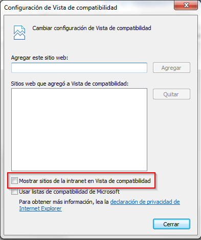

Almis Web Engine > **[Home](../README.md)**

---

# **Requirements**

## Table of Contents

* **[Development requirements](#development-requirements)**
  * [Hardware requirements](#hardware-requirements)
  * [Software requirements](#software-requirements)


## Development requirements

### Hardware requirements
Any modern computer will be a good development computer. Take into consideration that resource usage will grow as your project grows. A good starting point will be:
* At least 8Gb of RAM.
* At least 1Gb of free on your hard driver for local Maven repository.
* Free space for your project files (this depends on your project size but 1Gb will be a good starting point).
* A modern CPU with at least 2 cores.


### Software requirements

#### Java

AWE needs Oracle Java JDK 1.7 and has been tested with 1.7.0_40 version.

#### IDE

AWE is a Maven compatible project. It can be compiled and packaged on a system that has Maven. In order to develop AWE based web applications it is recommended to use one on the following IDEs.

* Netbeans Java EE 8
* Eclipse IDE for Java EE Developers Luna with m2e connector for the Maven Dependency Plugin.

#### Maven
Your IDE must be configured to use Maven (embedded version of the IDE or command line client). If you want to use Maven from command line, you can download it from http://maven.apache.org/ (download 3.2.3 version).
You have to add the following section to your Maven settings.xml file in order to be able to use AWE's WebApp archetype (`awe-webapp-archetype`) and to be able to download AWE from Almis repository (remember to replace ___YourUser___ with your actual Almis repository username and ___YourPassword___ with your Almis repository password).

```xml
<server>
  <id>awe-webapp-archetype-repo</id>
  <username>YourUser</username>
  <password>YourPassword</password>
</server>
```    

```xml
<server>
  <id>almis-awe</id>
  <username>YourUser</username>
  <password>YourPassword</password>
</server>
```

#### Web Container
AWE is compatible with the following web application containers:

* tomcat 7.0.47 or above
* IBM WebSphere 8.5 or above
* JBoss 6 or above


#### Database Server

AWE is compatible with the following database servers using JDBC connectors (each jar will need to be placed on classpath):
* SQL Server 2012
* Oracle 11
* HSQL Server 2.3.3


#### Web browser
AWE is tested to work the following web browsers.    
* Firefox 33.0
* Google Chrome
* Internet Explorer 11
* Opera 29.0
* Safari 8

For Internet Explorer you uncheck the compatibility option in Settings-->Compatibility View settings

  
