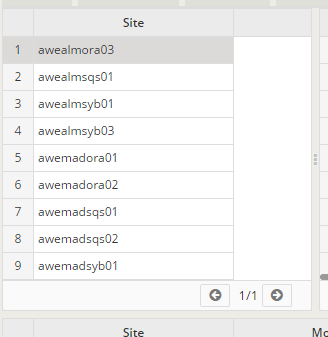

### Almis Web Engine - [Basic Development Guide](basic-developer-guide.md) - **[Screen development](basic-screen-development.md)**

---

# **Resizable**

## Table of Contents

* **[Introduction](#introduction)**
* **[XML skeleton](#xml-skeleton)**
* **[Resizable attributes](#resizable-attributes)**
* **[Examples](#examples)**

---

## Introduction

A resizable is a a container which can be resized grabbing one of its sides.

## XML skeleton

```xml 
<resizable directions="[directions]" style="[style]">
  ...
</resizable>
```

## Resizable attributes

| Attribute   | Use      | Type      |  Description                    |   Values                                           |
| ----------- | ---------|-----------|---------------------------------|----------------------------------------------------|
| id          | Optional | String    | Resizable identifier. For reference purposes |                                       |
| directions  | **Required** | String    | Resizable grabber position |  `right`, `left`, `top`, `bottom`   |
| style       | Optional | String    | Window CSS classes              |  |

> **Note:** Resizable should always have a initial width or height defined by a css class.

## Examples

### Resizable with a grabber to the right

```xml 
<resizable directions="right" style="col-xs-12 col-sm-4 col-lg-2 no-padding">
  <grid id="MatSel" style="expand grid-bordered" initial-load="query" server-action="data" target-action="QryUniTst" max="10">
    <column label="COLUMN_SIT" sort-field="Als" name="Als5" charlength="25" />
  </grid>
</resizable>
```


