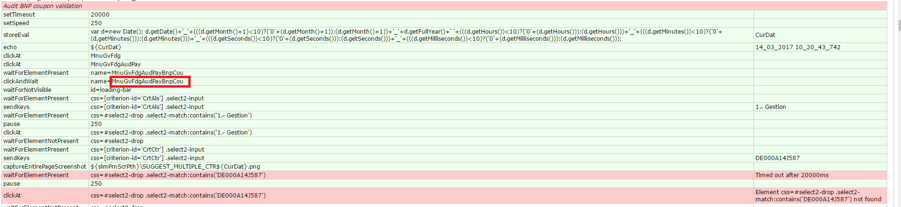
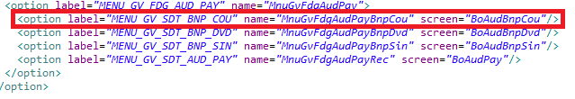
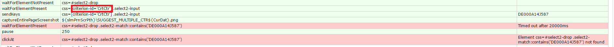
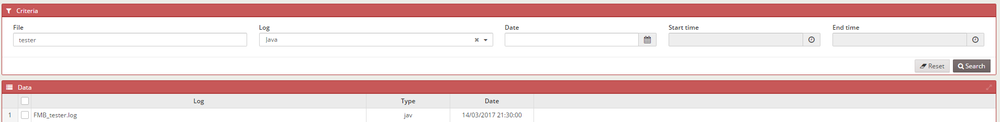
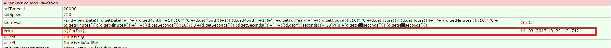
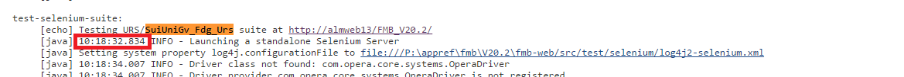
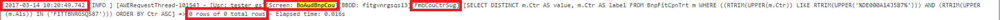
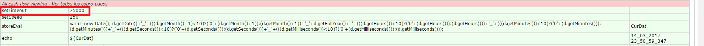
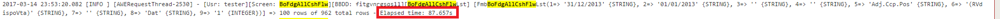

Almis Web Engine > **[Home](../README.md)**

---

# **Selenium Error Detection** 

## Table of Contents

* **[Basic instructions](#basic-instructions)**
  * [Find screen](#find-screen)
  * [Find associated action](#find-associated-action)
  * [Open log file](#open-log)
  * [Find action in the log](#find-action)
  * [Error causes](#error-causes)
  * [Detect agent crashes (only for projects with C services)](#detect-agent-crashes)

## Basic instructions

This section shows some basic instructions in order to show how could we easily find the causes of an error. A real example will be used.

### Find screen

We go to the test execution that has failed, and in the beginning of the test we can see which is the screen that the test opens: 

In this example, we see that we get a timeout when trying to select a value in a criterion. As we can see in the image, the screen used in the test is associated to **"MnuGvFdgAudPayBnpCou"** menu option. The next step is to open the menu file (private.xml) of the project and find the menu option:

In the current example, we can see that the screen is **"BoAudBnpCou"**

### Find associated action

Once we have detected the screen, the following step is to detect the action associated to the component that has failed. In this case we've seen that the error is associated to a criterion, but it could be the execution of a maintain, the filter of a grid or any other action. As seen in the previous image, the error is associated to **"CrtCtr"** criterion:

The next step is to find the criterion in the screen we have detected in the previous step, and check the action that is launched to fill this criterion:

For the example we are using, the action is "FmbCouCtrSug".

### Open log file

AWE has a log screen that can be included in our projects. In most of the cases we can find it in **"Tools --> Log"** menu option. Once we open the screen, we have to find the Java log of tester user:

It is also important to know the date in which the test was launched, so we also can filter by date. Anyway, as we will see later, each row of the logs shows the date/time in which each action was executed so it is easy to find what we want.

### Find action in the log

Once we open the log, we have to find the screen and action we are looking for. As said before, there could be more than one execution of this test so it is important to know in date/time when the test was executed. For doing this, there are two options:

1.  In some cases, the date of execution is printed in the beginning of the test:

2 . If this is not available, we can go to Jenkins output and check the time in which the suite was launched:

Now we know the screen, the action, and the execution time, we have to find them in the log:

As we can see in the image, this line matches with the execution time, the screen, and the action we have found in the previous steps. In this case the cause of the error is clear, the query that is executed does not return any line so the option we are trying to select does not exist in the database.

### Error causes

The usual error causes of selenium executions are the following ones:

1. The action that is executed does not return the expected values (this happens in the example we have seen).
2. An error is shown in the log. In this case it means there is a coding error and we'll need to debug the error and solve the problem.
3. The action lasts more than the timeout we've set for the test. In the beginning of the test we set a timeout in miliseconds:

  

In the log, we can see how much time has an action lasted:

In this case we see that execution time (87.657 seconds) is higher than the timeout (75000 miliseconds) and it is the cause of the error. The solution in this case is to increase the timeout of the test (at least higher than 87.657 seconds).

### Detect agent crashes

When we work with C services, it can happen that an agent has crashed (died) and a test has failed because this agent wasn't available. For checking this we have to do the following:

1.- We search the text “Hearbeat KO” in the log file (for instance FMB.log). The Hearbeat is a process that checks if the agents are available and tries to launch them again when they are not available. In the following image we see that an agent has crashed, the heartbeat has detected it and has relaunched it again:

2.- In the previous step we have detected and agent crash around 1:08 a.m. The frequency of the HEARTBEAT execution is configured in *wbs.agn.hbt.tim* property. In this case it is configured to 5 minutes, so we guess that the crash has happened between 1:03 and 1:08. If we find the text "Connection refused" in the log file, we'll see which is the first service execution that failed because the agent wasn't up:

3.- The previous image shows that the crash has been before 1:04, so we have to analyze the log files that are in WEB folder and have been launched around or before 1:04. In the following image we can see the log that has been created when the HEARTBEAT has relaunched the agent (in green), and the log files we have to analyze for finding wich has provoqued the crash (in red):

4.- Analyzing those log files, we see that there is one that has crashed. This is detected because the log file is incompleted and does not return any value:

