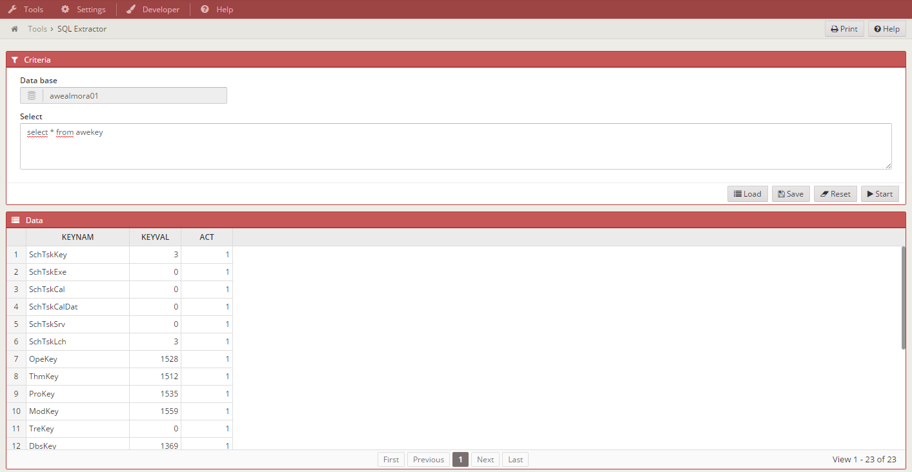
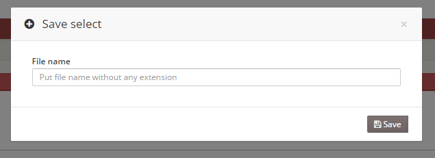
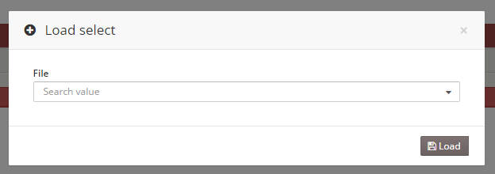

### Almis Web Engine - **[Modules](modules.md#tools-module)**

---

# **SQL extractor**

## What is it

This is a tool to make queries in the database that your application is working.



## What can I do?

### Run SQL queries with the database in use.

"We can only execute queries, you want to execute insert, update or deletes call to AWE team"


### Save query strings in files.

Put file name without extension, the application will put .txt extension for you. We can save only a query per file. This file will save automatically in your home directory. "c:/users/{user}/aweFiles/"



### Load querie strings from file to relaunch it.

Load files from your home directory "c:/users/{user}/aweFiles/"



## READ MODE AND WRITE MODE

By default sqlExtractor screen is in "Read" mode so you can only execute "select" statements. There is a hidden parameter in the screen called "sqlType" that has the "R" value to allow change the statements a user can execute.


&lt;criteria id="sqlType" component="hidden" value="R" /&gt;


In order to allow users or profiles to execute statements that modifies the database (insert, delete, drop, update) you must change the "sqlType" hidden parameter value to "W" (Write mode) for the sqlExtractor screen in the Screen configuration option.

## HACK

If you want to change the functionality you must overwrite the service as follows:

```XML
  <service id="selectExtract">
    <java classname="com.almis.{project}.services.controller.SqlExtractorController" method="extractData" >
      <service-parameter name="select"   type="STRING"/>
    </java>
  </service>
```

And add your own SqlExtractorController.java and SqlExtractorManager.java thats overwrite the AWE methods.

#### Example:

They must start with select(1)

```sql
select(1) INSERT INTO x (columns,...) VALUES (y,...)
```

