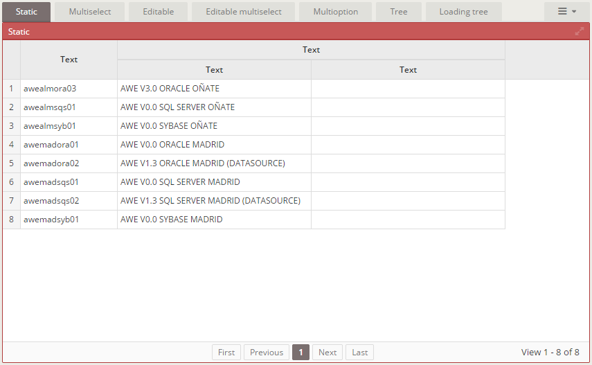

Almis Web Engine > [Basic Development Guide](basic-developer-guide.md) > **[Screen development](basic-screen-development.md)**

---

# **Tab and tabcontainer**

## Table of Contents

* **[Introduction](#introduction)**

## Introduction

A **tab** is a screen component very useful to separate the screen components in *tabs*:



## XML skeleton

```xml 
<tab id="[tab-identifier]" initial-load="[initial-load]" target-action="[target-action]" maximize="[maximize-tab]">
  <tabcontainer id="[tabcontainer-identifier-1]">
  ...
  <tabcontainer id="[tabcontainer-identifier-n]">
  <dependency...></dependency>
  <context-menu...></context-menu>
</tab>
```

## Tab structure

```xml
<tab id="[tab-identifier]" initial-load="[initial-load]" target-action="[target-action]">
   ...
</tab>
```

| Element     | Use      | Multiples instances    | Description                                        |
| ----------- |:-------:|:----------------------:|----------------------------------------------------|
| [tab](#tab-attributes) | **Required** | No      | Global node of tab. Defines the tab attributes |
| [tabcontainer](#tabcontainer-attributes) | **Required** | Yes | List of tabcontainers to show |
| [dependency](dependencies.md) | Optional | Yes | List of dependencies attached to the tab |
| [context-menu](context-menu.md) | Optional | No | Context menu attached to the tab |

## Tab attributes

| Attribute     | Use          | Type    | Description                   |   Values                                    |
| ------------- | :-----------: | :------: | ----------------------------- |---------------------------------------------|
| id            | **Required** | String  | Tab identifier. Needs to be the same as target-action values |              |
| initial-load  | **Required** | String  | Server action call to load the criterion data (launched at window generation) | `enum` (for [enumerated](enumerate-definition.md)) or `query` (for [query call](query-definition.md)) |
| target-action | **Required** | String  | Target to call on the server|                                             |
| style       | Optional | String    | Tab CSS classes              | **Note:** Here you can use `expand` class to set the tab as expandible |
| maximize    | Optional | Boolean   | Whether to show the maximize icon or not |                                  |

## Tabcontainer structure

```xml
<tabcontainer id="[tabcontainer-identifier]" type="[type]" label="[label]" style="[style]" expandible="[expandible]">
  ...
</tabcontainer>
```

## Tabcontainer attributes

| Attribute     | Use          | Type    | Description                   |   Values                                    |
| ------------- | :----------: | :-----: | ----------------------------- |---------------------------------------------|
| id            | **Required** | String  | Tabcontainer identifier. Needs to be the same as target-action values |     |
| label         | Optional | String    | Tabcontainer title                    | **Note:** You can use [i18n](i18n-internationalization.md) files (locales)          |
| style         | Optional | String    | Tabcontainer CSS classes              | **Note:** Here you can use `expand` class to set the window as expandible |
| type          | Optional     | String  | Tabcontainer HTML tag type                 | `div`, `span`, `p`, ...        |
| expandible    | Optional | String    | How to [expand](layout.md) the tabcontainer children | `vertical`, `horizontal`  |