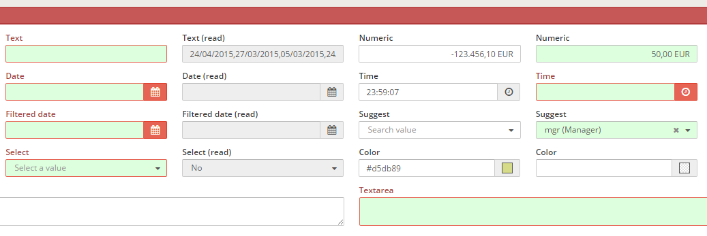

Almis Web Engine > [Basic Development Guide](basic-developer-guide.md) > **[Screen development](basic-screen-development.md)**

---

# **Validation**

## Table of Contents

* **[Introduction](#introduction)**
* **[XML skeleton](#xml-skeleton)**
* **[Validation types](#validation-types)**
  * [Validation values](#validation-values)
  * [Comparison types](#comparison-types)
* **[Multiple validation](#multiple-validation)**
* **[Examples](#examples)**

## Introduction

The validation action checks the conditions of each criterion with a value under the validation attribute. This action is related with a `validate` type button (see [button actions](button.md#button-actions)).



## XML skeleton

```xml 
<criteria [attributes] validation="[condition to validate]" />
```

## Validation types

There are some kind of validation:

| Value of attribute    | Description                                                  | Examples       |
| --------------------- | -------------------------------------------------------------| ---------------|
| required              | Check if the field has value                                 | `validation="{required:true}"` |
| text                  | Check if the value of the criteria is a text (Numbers and white spaces are not allowed)              | `validation="{text:true}"`             |
| textWithSpaces        | Check if the value of the criteria is a text (Numbers not allowed)              | `validation="{textWithSpaces:true}"`             |
| number                | Check if the value of the criteria is a number               | `validation="number"`             |
| integer               | Check if the value is a well-formed integer                  |  `validation="integer"`   |
| digits                | Check if the value is a number with only digits                  |  `validation="digits"`  |
| date                  | Check if the value is a valid date                           |   `validation="date"`  |
| time                  | Check if the value is a valid time (hour, minutes and seconds)                  | `validation="time"` |
| email                 | Check if the value is a valid string email             |  `validation="email"`              |
| invalid               | Check if the text is equal  to the parameter             | `validation="invalid"`              |
| gt                    | Check if the value is greater than the value of the parameter | `validation="{gt:`[value](#validation-values)`}"`      |
| ge                    | Check if the value is greater or equal than the value of the parameter | `validation="{ge:`[value](#validation-values)`}"`      |
| lt                    | Check if the value is lower than the value of the parameter | `validation="{lt:`[value](#validation-values)`}"`      |
| le                    | Check if the value is lower or equal than the value of the parameter | `validation="{le:`[value](#validation-values)`}"`      |
| eq                    | Check if the value is equal than the value of the parameter | `validation="{eq:`[value](#validation-values)`}"`      |
| ne                    | Check if the value is different than the value of the parameter | `validation="{ne:`[value](#validation-values)`}"`      |
| mod                   | Check if the value is divisible by the value of the parameter | `validation="{mod:`[value](#validation-values)`}"`      |
| range                 |  Check if the value is inside the range  | `validation="{range:{from:`[value](#validation-values)`, to:`[value](#validation-values)`}}"` |
| equallength           | Check if the text length is equal to the parameter value             |  `validation="{equallegth:`[value](#validation-values)`}"`  |
| maxlength             | Check if the text length is less than the parameter value             |  `validation="{maxlegth:`[value](#validation-values)`}"`  |
| minlength             | Check if the text length is bigger than the parameter value   | `validation="{minlength:`[value](#validation-values)`}"`             |
| checkAtLeast          | Check if there is a value like the field in the list       | `validation="{checkAtLeast:`[value](#validation-values)`}"`   |
| pattern               | Check if the text is equal  to the parameter             | `validation="{pattern:`[value](#validation-values)`}"`              |
 
### Validation values

You can put a simple static value to the validation comparator:

```javascript 
{eq:3}
```

... or you can take the value from a setting or a criterion:

```javascript 
{eq:{criterion:"CriterionId",type:"date"}}
```

These are the possible attributes on a value comparator:

| Value of attribute  | Description                                                 | Examples                                    | 
| ------------------- | ----------------------------------------------------------- | ------------------------------------------- | 
| value               | Constant value to compare with                              | `value:5`                                   | 
| criterion           | Retrieve the value from a criterion                         | `criterion:"CriterionId"`                   |
| setting             | Retrieve the value from a setting                           | `setting:"minlengthPassword"`               |
| message             | Locale from message to retrieve if validation is not passed | `message:"VALIDATION_MESSAGE_CUSTOM_ERROR"` |
| type                | Type of comparison                                          | `type:"`[type](#comparison-types)`"`        |

### Comparison types

You can define the type of the comparison, to check the values as a defined type:

| Type    | Description                    | 
| ------- | ------------------------------ | 
| date    | Compare as dates               | 
| integer | Compare as integer             | 
| float   | Compare as floats              |  
| string  | Compare as strings (default)   |  
       
## Multiple validation

It is possible to have more than one validation actions under a single `validation` attribute. To do so, it is necessary to insert the validations in a json format:

```javascript 
{eq:{criterion:"Field1"},ne:{criterion:"Field2"}}
```

There is an exception with simple validation rules that have no parameters, such as `required`. In this case, it's not necessary to have the rule between `{}` brackets:

```xml
validation="required"
```

If you want to combine simple rules with complex rules, you need to define it as a complex rule as well: 

```javascript 
{required:true, maxlength:{value:6, type:"integer"}}
```

## Examples

### Standard criteria with validation action

```xml
<criteria label="PARAMETER_TEXT" id="TxtReq" variable="TxtReq" component="text" style="col-xs-6 col-sm-3 col-lg-2" validation="{required:true, maxlength:4}"/>

```

### Check that the password is valid

```xml
<criteria label="PARAMETER_PASSWD" id="Pas" component="text" 
validation="{required: true, pattern:{setting:'passwordPattern'}, ne:{criterion:'OldPas', message:'VALIDATOR_MESSAGE_REPEAT_OLD_PASSWORD'}, minlength:{setting:'minlengthPassword'}}" 
style="col2" />
```

### Check if a date is greater or equal than another

```xml
<criteria label="PARAMETER_FILTERED_DATE" id="FilCalReq" variable="FilCalReq" component="filtered-calendar" initial-load="query" 
target-action="FilCalDat" style="col-xs-6 col-sm-3 col-lg-2" validation="{required:true,ge:{criterion:'FilCal',type:'date'}}" strict="false" />
```
        

