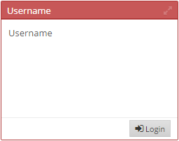
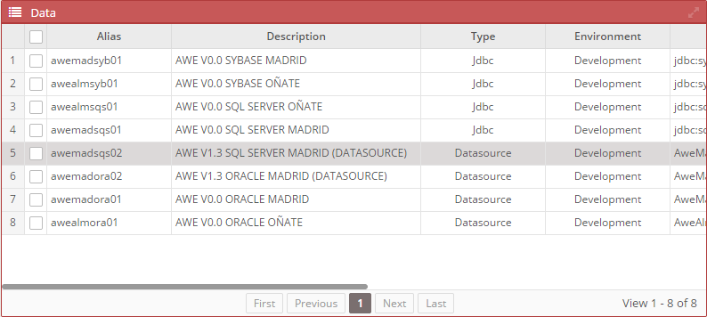

### Almis Web Engine - [Basic Development Guide](basic-developer-guide.md) - **[Screen development](basic-screen-development.md)**

---

# **Window**

## Table of Contents

* **[Introduction](#introduction)**
* **[XML skeleton](#xml-skeleton)**
* **[Window structure](#window-structure)**
* **[Window attributes](#window-attributes)**
* **[Examples](#examples)**

---

## Introduction

A window is a a container with a title bar. It also can be maximized or restored, and is very useful to sort groups of components in the screen.



## XML skeleton

```xml 
<window id="[window-identifier]" label="[window-label]" style="[window-style]"
        icon="[window-icon]" expandible="[expand-orientation]" maximize="[maximize-window]">
  <tag type="div" style="panel-body">...</tag>
  <tag type="div" style="panel-footer">...</tag>
  ...
  <grid>...</grid>
  ...
  <chart>...</chart>
  ...
</window>
```

## Window structure

| Element     | Use      | Multiples instances    | Description                                        |
| ----------- | ---------|------------------------|----------------------------------------------------|
|[window](#window-attributes) | **Required** | No | Global node of window. Describes the window attributes |
| [tag](tags.md) | Optional | Yes | A [tag](tags.md) list inside the window, usually with styles like `panel-body` and `panel-footer` |
| [grid](grids.md) | Optional | No | A [grid](grids.md) inside the window  |
| [chart](chart-development.md) | Optional | No | A [chart](chart-development.md) inside the window |

> **Note** There are two special styles you can use as tag styles on windows:
> * `panel-body`: A special style to define the content of a window. It adds margins to the content.
> * `panel-footer`: A special style to define the bottom of a window. It is recommended to put buttons inside.
> * `expand-maximize`: A special style usually combined with `panel-body` which expands the content of the window when it is maximized.

## Window attributes

| Attribute   | Use      | Type      |  Description                    |   Values                                           |
| ----------- | ---------|-----------|---------------------------------|----------------------------------------------------|
| id          | Optional | String    | Window identifier. For reference purposes |                                          |
| label       | Optional | String    | Window title                    | **Note:** You can use [i18n](i18n-internationalization.md) files (locales)          |
| style       | Optional | String    | Window CSS classes              | **Note:** Here you can use `expand` class to set the window as expandible |
| icon        | Optional | String    | Icon identifier                 | **Note:** You can check all iconset at [FontAwesome](http://fontawesome.io/icons/) |
| expandible  | Optional | String    | How to [expand](layout.md) the window children | `vertical`, `horizontal` |
| maximize    | Optional | Boolean   | Whether to show the maximize icon or not |                                  |
| report-title | Optional | String    | Is the title of the report that is generated when printing the screen. If we do not define a value for this attribute report title will be taken from label attribute | **Note:** You can use [i18n](i18n-internationalization.md) files (locales)          |
## Examples

### Expandible window with grid (maximizable)

```xml 
<window style="expand" maximize="true" label="SCREEN_TEXT_DATA" icon="list">
  <grid ...>...</grid>
</window>
```



### Static window with content and buttons zone

```xml 
<window label="SCREEN_TEXT_CRITERIA" icon="filter">
  <tag type="div" style="panel-body">...</tag>
  <tag type="div" style="panel-footer">
    <tag type="div" style="pull-right">...</tag>
  </tag>
</window>
```

